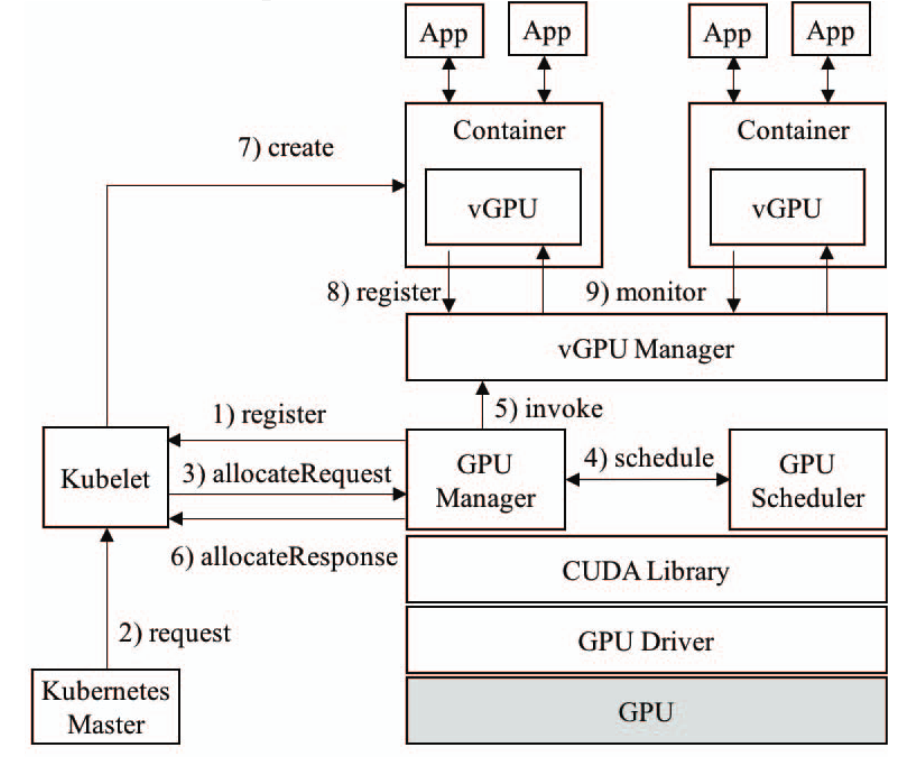
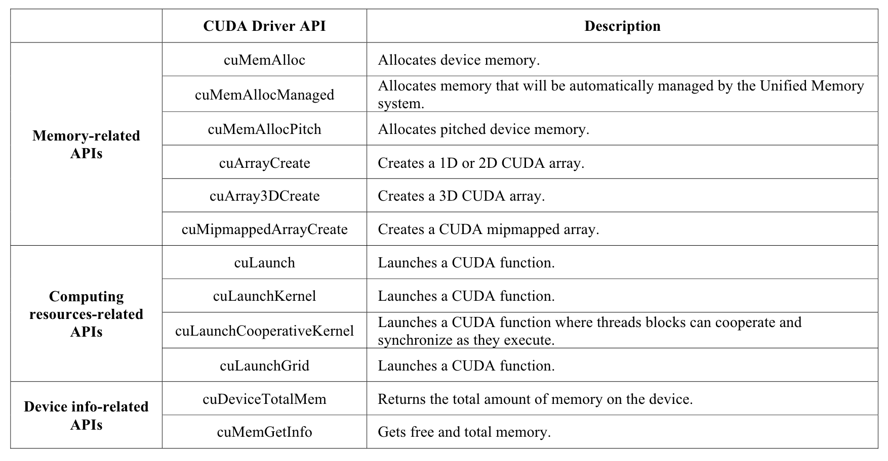

# GaiaGPU: Sharing GPUs in container clouds

## Metadata

Presented in [ISPA/IUCC/BDCloud/SocialCom/SustainCom 2018](https://ieeexplore.ieee.org/document/8672318/).

Authors: Jing Gu, Shengbo Song, Ying Li, Hanmei Luo

Code
- vcuda-controller: [https://github.com/tkestack/vcuda-controller](https://github.com/tkestack/vcuda-controller)
- GPU admission: [https://github.com/tkestack/gpu-admission](https://github.com/tkestack/gpu-admission)
- GPU Manager: [https://github.com/tkestack/gpu-manager](https://github.com/tkestack/gpu-manager)

## Understanding the paper

### TL;DR

This paper presents an approach named **GaiaGPU**, to **share GPU memory and computing resources** among containers. It gives a solution for providing GPU sharing in the cloud.

### Technical details

- 
- **The vGPU Library** running in the container is used to manage the GPU resources.
    - It intercepts the memory-related APIs and the computing-related APIs in the CUDA Library by the `LD_LIBRARY_PATH` mechanism. 12 CUDA Driver APIs are intercepted.
    - 
- Two allocation methods are adopted to improve the utilization.
    1. **Elastic resource allocation**: **temporarily** modify the computing resource limit of the container, soft limit. The max utilization of GPU is set as a parameter and the default value is **90%**.
    2. **Dynamic resource allocation**: **permanently** modify the resource allocation (memory, computing resource) of the container, hard limit.

### Limitations

- The experimental part is rudimentary; only the micro-benchmark has been done.
- The effect of elastic allocation of computing resources does not seem to be particularly stable.

