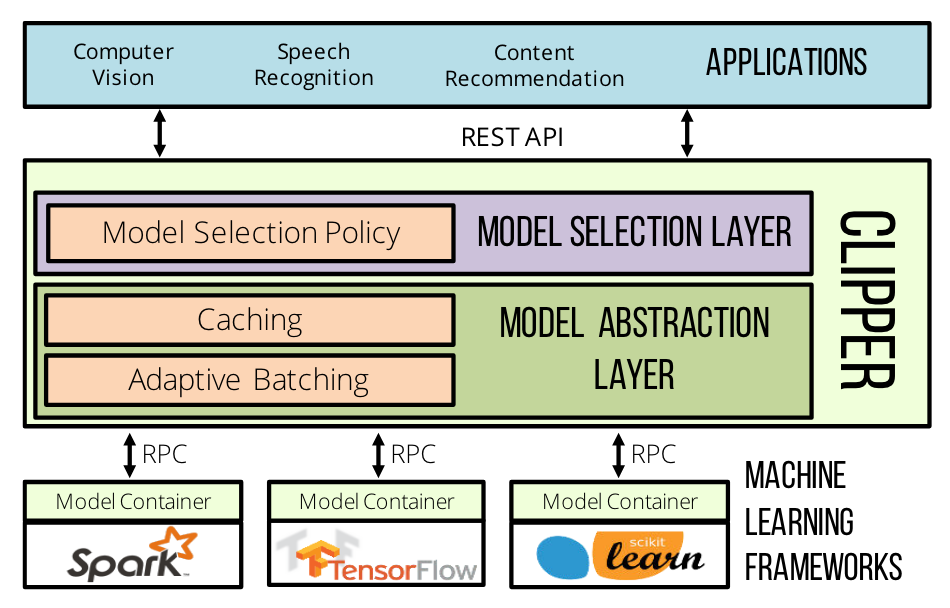

# Clipper: A low-latency online prediction serving system

## Metadata

Presented in [NSDI 2017](https://www.usenix.org/conference/nsdi17/technical-sessions/presentation/crankshaw).

Authors: Daniel Crankshaw, Xin Wang, Guilio Zhou, Michael J. Franklin, Joseph E. Gonzalez, Ion Stoica

Homepage: [http://www.clipper.ai/](http://www.clipper.ai/)
Code: [https://github.com/ucbrise/clipper](https://github.com/ucbrise/clipper)

## Understanding the paper

### TL;DR

This paper presents a general-purpose model serving system named **Clipper**, which introduces a modular architecture to **simplify model deployment across frameworks and applications**, including **caching**, **batching**, and **adaptive model selection** techniques.

### Three crucial properties of model serving system

- Low latency
- High throughput
- Improved accuracy

### Technical details

- Clipper is divided into two layers.
    - 
    - **Model abstraction layer**: provide a common interface across machine learning frameworks.
        - **Caching**: maintain a prediction cache, LRU eviction policy.
        - **Adaptive query-batching**: batching amortizes the cost and enables data-parallel optimizations in ML frameworks.
            - Dynamic batch size: additive-increase-multiplicative-decrease (AIMD) scheme
            - Delayed batching: batch wait timeout
        - **Model containers**: each model is managed in a separate Docker container, supports replica scaling.
    - **Model selection layer**: dispatch the prediction request to one or more of the models through the model abstraction layer.
        - **Single model selection**: treat as a multi-armed bandit problem (exp3 algorithm)
        - **Ensemble model selection** (exp4 algorithm): combine predictions from multiple models, mitigate stragglers (causes some problems, e.g., ensemble missing, reduction in accuracy, *rendering a late prediction is worse than rendering an inaccurate prediction*)
        - **Personalized model selection (Contextualization)**: instantiate a unique model selection state for each user, context or session.
- Clipper uses **a cross-language RPC** to send the batch of queries to a model container hosting the model in its native machine learning framework.

### Comparison

- Compared to Tensorflow Serving, Clipper shows the modular architecture and substantially broader set of features with minimal performance penalty.
- Different from general serving systems: the dominant cost in **data-serving systems** tends to be **IO**, in **prediction serving** it is **computation**.

### Limitations

1. Doesn't optimize the execution of the models. Treat the models as black-box components.
2. Doesn't manage the training or retraining.

