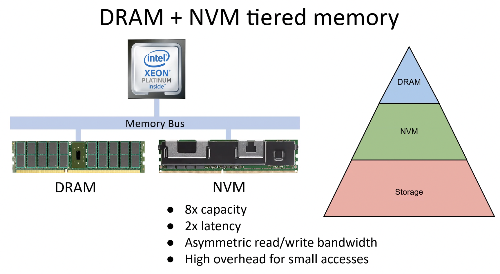

# HeMem: Scalable Tiered Memory Management for Big Data Applications and Real NVM

## Metadata

Presented in [SOSP '21](https://dl.acm.org/doi/10.1145/3477132.3483550). \[ [Paper](https://dl.acm.org/doi/pdf/10.1145/3477132.3483550) | [Video](https://www.youtube.com/watch?v=JL2Takrgu78) | [Code](https://bitbucket.org/ajaustin/hemem/src/sosp-submission) ]

Authors: Amanda Raybuck, Tim Stamler, Wei Zhang, Mattan Erez, Simon Peter _The University of Texas at Austin, Microsoft_

## Understanding the paper

### Some concepts

* Tiered Memory Management (i.e., hybrid DRAM-NVM architecture)

### Existing problems

1. Hardware tiered memory management systems (i.e., Application <=> Hardware Tiered Memory directly includes DRAM and NVM)
   * Example: Intel Optane DC memory mode
   * Adv.
     * No OS support needed
     * Low overhead
   * Disadv.
     * No visibility into applications
     * Limited to simple management techniques
2. Existing software-based memory management systems (i.e., Application <=> OS/Library Tiered Memory => DRAM or NVM)
   * Example: HeteroOS, Nimble Page Management
   * Adv.
     * Benefit from the access patterns
     * Support complex policies
   * Disadv.
     * Only evaulate on **emulated NVM** , current methods cannot scale due to page table overheads (so there indicates this work will adopt another metric?)
     * No support for asymmetric read/write bandwidth (but why these previous works don't consider this?)
     * Limited flexibility (it is so subjective)

Question: How to maximize the performance of big data applications on **real NVM**?

### Key motivation

* Monitor application memory use by **sampling memory access via CPU events,** rather than **page tables**
  * In detailed, previous memory access tracking methods that leverage page table access and dirty bits have high CPU overhead for scanning page tables and TLB shootdowns when bits are cleared
* Asynchronously use DMA to migrate memory
* Consider asymmetric NVM read/write bandwidth
* Improve the flexibility
  * Enable memory management in a user-level library (low overhead to monitor application memory access and allocation patterns)

### Main Contributions

This paper presents HeMem, an OS tiered memory management system that dynamically manages tiered memory **without the CPU overhead** of page access bit tracking, associated TLB shootdowns, and memory copies, but **with advanced policy support** for various memory access and allocation patterns, as well as performance isolation.

### Implementation

HeMem is implemented as a user-level library on top of Linux version 5.1.0, with two userfaultfd patches applied.

### Related work

* Intel Optane DC Persistent Memory. http://www.intel.com/optanedcpersistentmemory.
* userfaultfd: write protection support. https://patchwork.kernel.org/cover/11005675/.
* userfaultfd(2). http://man7.org/linux/man-pages/man2/userfaultfd.2.html.
* Direct Access for files. https://www.kernel.org/doc/Documentation/filesystems/dax.txt.
* Sudarsun Kannan, Ada Gavrilovska, Vishal Gupta, and Karsten Schwan. 2017. HeteroOS: OS Design for Heterogeneous Memory Management in Datacenter. In Proceedings of the 44th Annual International Sympo- sium on Computer Architecture (ISCA ’17). Association for Computing Machinery. https://doi.org/10.1145/3079856.3080245
* Zi Yan, Daniel Lustig, David Nellans, and Abhishek Bhattacharjee. 2019. Nimble Page Management for Tiered Memory Systems. In Proceedings of the Twenty-Fourth International Conference on Architectural Support for Programming Languages and Operating Systems (ASPLOS ’19). Association for Computing Machinery. https://doi.org/10.1145/3297858.3304024
