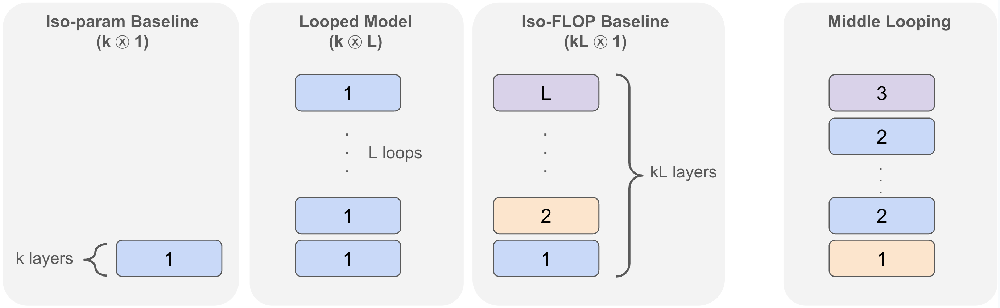

# Looped Transformers

> **Looped Transformers** repeatedly apply shared Transformer blocks to refine hidden states, increasing effective computational depth without adding a new set of weights at every step.

<!-- Figure source: Saunshi et al., Reasoning with Latent Thoughts: On the Power of Looped Transformers (ICLR 2025), Figure 1: https://arxiv.org/html/2502.17416v1#S1.F1. License: CC BY 4.0 (https://creativecommons.org/licenses/by/4.0/). -->
<figure><figcaption>
A looped Transformer reuses the same k-layer block for L iterations; middle looping repeats only the middle block.
</figcaption></figure>

## Foundations

* Looped Transformers are Better at Learning Learning Algorithms (ICLR 2024) \[[Paper](https://openreview.net/forum?id=HHbRxoDTxE)] \[[arXiv](https://arxiv.org/abs/2311.12424)] \[[Code](https://github.com/Leiay/looped_transformer)]
  * UW-Madison
  * Trains a shared Transformer block to emulate iterative learning algorithms for in-context regression and other data-fitting tasks.
  * Matches standard Transformers on the studied tasks with less than 10% of their parameter count.
* Looped Transformers as Programmable Computers (ICML 2023) \[[Paper](https://proceedings.mlr.press/v202/giannou23a.html)] \[[arXiv](https://arxiv.org/abs/2301.13196)]
  * UW-Madison & Princeton
  * Constructs a constant-depth looped Transformer that executes programs encoded in its input, including memory operations, function calls, and conditional branches.
  * Demonstrates calculator, linear-algebra, and in-context backpropagation programs with a frozen Transformer.
* Universal Transformers (ICLR 2019) \[[Paper](https://openreview.net/forum?id=HyzdRiR9Y7)] \[[arXiv](https://arxiv.org/abs/1807.03819)]
  * Amsterdam & DeepMind & Google Brain
  * Introduces **Universal Transformer (UT)**: self-attentive recurrence across depth with shared weights and parallel processing across sequence positions.
  * Adds per-position halting with Adaptive Computation Time (ACT); improves algorithmic and language tasks and establishes Turing completeness under stated assumptions.

## Reasoning, Generalization, and Mechanisms

* Reasoning with Latent Thoughts: On the Power of Looped Transformers (ICLR 2025) \[[Paper](https://proceedings.iclr.cc/paper_files/paper/2025/hash/2676109d49d1eb26d6bc584a8f556305-Abstract-Conference.html)] \[[arXiv](https://arxiv.org/abs/2502.17416)]
  * Google Research & TTIC
  * Shows that a shallow Transformer looped multiple times can approach deeper untied models on synthetic and language-model reasoning tasks.
  * Proves that looped models can simulate chain-of-thought steps through latent computation, separating effective depth from parameter count.
* Looped Transformers for Length Generalization (ICLR 2025) \[[Paper](https://openreview.net/forum?id=2edigk8yoU)] \[[arXiv](https://arxiv.org/abs/2409.15647)] \[[Code](https://github.com/UW-Madison-Lee-Lab/looped-tf)]
  * UW-Madison & MIT & UC Berkeley
  * Trains looped Transformers with adaptive step counts on tasks expressible as repeated operations in RASP-L, a learnable subset of the Restricted Access Sequence Processing language.
  * Improves extrapolation to unseen input lengths on arithmetic and algorithmic tasks.
* Can Looped Transformers Learn to Implement Multi-step Gradient Descent for In-context Learning? (ICML 2024) \[[Paper](https://proceedings.mlr.press/v235/gatmiry24b.html)] \[[arXiv](https://arxiv.org/abs/2410.08292)]
  * MIT & Google Research
  * Proves that population-loss minimizers of linear looped Transformers implement multi-step preconditioned gradient descent for in-context linear regression.
  * Establishes gradient-flow convergence through a gradient-dominance condition, addressing learnability beyond expressivity.

## Recurrent-Depth Language Models and Latent Reasoning

* Scaling up Test-Time Compute with Latent Reasoning: A Recurrent Depth Approach (NeurIPS 2025) \[[Paper](https://proceedings.neurips.cc/paper_files/paper/2025/hash/3b01972cf31e6fa0fe29e4b8b5c2a0a1-Abstract-Conference.html)] \[[arXiv](https://arxiv.org/abs/2502.05171)] \[[Code](https://github.com/seal-rg/recurrent-pretraining)]
  * ELLIS Institute Tübingen & Max Planck Institute for Intelligent Systems & Tübingen AI Center & UMD & LLNL
  * Trains **Huginn**, a 3.5B-parameter recurrent-depth language model, on 800B tokens without specialized reasoning supervision.
  * Scales inference computation by iterating a latent block; studies adaptive per-token compute, key-value (KV) cache sharing, and speculative decoding.
* Scaling Latent Reasoning via Looped Language Models (arXiv:2510.25741) \[[arXiv](https://arxiv.org/abs/2510.25741)] \[[Homepage](https://ouro-llm.github.io/)]
  * ByteDance Seed & UCSC & Princeton & Mila & UdeM & PKU & CMU & UPenn & Conscium & Manchester & M-A-P
  * Introduces **Ouro / LoopLM**, combining recurrent latent computation with an entropy-regularized objective for learned depth allocation during pretraining.
  * Scales training to 7.7T tokens and uses controlled experiments to separate knowledge manipulation from knowledge capacity.

## Extensions to Diffusion Models

* Looped Diffusion Transformer (arXiv:2609.40305) \[[arXiv](https://arxiv.org/abs/2609.40305)] \[[Code](https://github.com/OpenSenseNova/Looped-DiT)]
  * SenseTime Research & THU & NTU
  * **Looped-DiT** reuses Transformer blocks within each denoising step, combining intermediate-loop supervision with self-modulating attention.
  * Compares extra recurrent depth with extra denoising steps under fixed inference budgets and evaluates text-to-image generation at matched parameters and compute.
