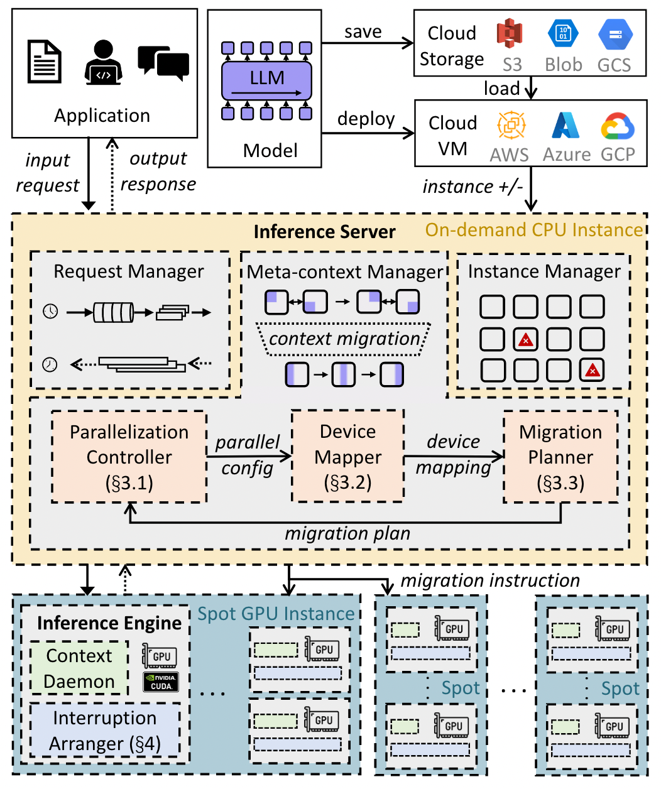

# SpotServe: Serving generative large language models on preemptible instances

## Meta Info

Presented in [ASPLOS 2024](https://arxiv.org/abs/2311.15566).

## Understanding the paper

### TL;DR

* SpotServe — the first distributed LLM serving system on _preemptible instances_
* Techniques
  * Dynamically adapt the LLM parallelization configuration
  * Minimize the cost of migrating instances for dynamic reparallelization
    * Formulated as a bipartite graph matching problem → use the KuhnMunkres algorithm to identify an optimal migration plan
  * Stateful inference recovery
    * Commit inference progress at a much finer granularity
    * Resume inference upon preemption

### Background

* Spot instances
  * Lower price than on-demand instances
  * May be preempted at any time
  * Grace period (e.g., 30 seconds for AWS spot instances)

### Existing works

* Leverage spot instances to reduce the monetary cost of DNN inference
  * Example: [MArk](https://www.usenix.org/conference/atc19/presentation/zhang-chengliang), [Cocktail](https://www.usenix.org/conference/nsdi22/presentation/gunasekaran)
  * Limitation: Target _small_ DNN models that can _fit on a single spot instance_ with one or multiple GPU
  * Handle preemptions using _request rerouting_ or _redundant computation_

### Challenges in serving LLMs on spot GPU instances

* Dynamic reparallelization — how to quickly adapt to changes to spot instances’ availability and requests’ arrival rates?
* Instance migration — how to minimize the cost of migrating GPU instances for reparallelization?
* Grace period — how to leverage grace period to handle unfinished request?

### Designs

<figure><figcaption>
An overview of SpotServe
</figcaption></figure>

* **Inference Server**
  * Deployed on a dedicated _on-demand CPU instance_
  * Three components
    * **Request Manager**
      * Receiving input requests
      * Dynamically partition them into batches
      * Assign these batches to inference instances running on spot GPU instances
      * Collect generated outputs from the inference instances
      * Send the results back to users
    * **Meta-context Manager**
      * Manage the adjustment of the parallel configuration by sending instructions for context migration to all GPU instances
      * Modules
        * **Parallelization Controller**
          * Adjust the parallelization configuration to improve LLM serving performance
          * A parallel configuration — $$C = (D, P, M, B)$$
            * $$D$$ — data parallelism degree
            * $$P$$ — pipeline-model parallelism degree
            * $$M$$ — tensor-model parallelism degree
            * $$B$$ — the maximum mini-batch size
          * Measure the initialization time in advance
          * _Adaptive optimization algorithm_
            * Two variables $$C_t$$ and  at time step $$t$$
              * $$C_t$$ — parallel configuration
              * $$N_t$$ — the number of available instances
                * Include newly allocated instances
                * Exclude instances to be preempted
            * Minimizes the end-to-end inference latency $$l_{req}(C)$$ while maintaining a throughput higher than $$\alpha_𝑡$$
            * If multiple configurations can achieve similar minimum inference latency → Select the configuration with _lower monetary cost_ (i.e., using fewer instances)
            * If peak serving throughput can not exceed the request arrival rate $$\alpha_𝑡$$ → Maximize the overall serving throughput
            * _Optionally_ allocate on-demand instances to improve serving throughput
            * Run the online algorithm, negligible overhead (i.e., less than 1s)
            * Offline estimate the latency of different configurations in advance
        * **Device Mapper**
          * Use the Kuhn-Munkres (KM) algorithm to find an optimal device mapping → Maximally reuse the model parameters and KV cache on available GPU instances & minimize the total data transmission
          * Device mapping — a bipartite graph $$\mathcal{G} = (\mathcal{V_a}, \mathcal{V_t}, \varepsilon)$$
            * $$u \in \mathcal{V_a}$$ — a GPU device
            * $$v \in \mathcal{V_t}$$ — a pipeline-stage-shard position of the parallel configuration
            * a weighted edge $$𝑒_{𝑢𝑣}$$ — the amount of reusable model parameters and key/value cache when mapping GPU 𝑢 to position 𝑣 of the parallel configuration
          * Build a complete bipartite graph and compute the edge weight between every $$(𝑢, 𝑣)$$ pair using the size of their intersection contexts
          * If the new parallel configuration handles less concurrent inference requests
            * Discard part of the cached results → avoid exceeding the memory capacity of the new parallel configuration
            * Keep the batches of requests with more decoding progresses
        * **Migration Planner**
          * Determine the exact _migration plan_ to finish the configuration adjustment
          * _Progressive migration_ schedule — utilize the pipeline structure and prioritize the migration of front model layers’ context
          * Consider the memory usage during the progressive migration process
    * **Instance Manager**
      * Interacts with the cloud and receives instance preemption/acquisition notifications
      * _Allocates on-demand and spot instances at the same time_ to avoid the waiting overhead when spot-instance allocation fails
      * Prefer to release on-demand instances
      * _Keep few additional instances_ (e.g., 2 in experiments) to alleviate the impacts of frequent disturbance of instance availability
* **Inference Engine**
  * Deployed on each spot or on-demand GPU instance to serve LLM inference
  * Components
    * **Context daemon**
      * Manages the model parameters (i.e., _model context_) and intermediate activations (i.e., _cache context_) for different requests inside a certain GPU
    * **Interruption Arranger**
      * Support stateful inference recovery
* Stateful inference recovery
  * Recover interrupted inference request without recomputation
  * Context daemon maintains the cache context of an inference request
  * Route the request to another inference pipeline using the cached state
  * Just-in-time arrangement
    * Each spot GPU instance includes _an interruption arranger_ that receives a notification when a grace period starts
  * Fault tolerance
    * Delay the acquired instance joining and make the arrangements for prior interruptions feasible
    * One instance gets preempted before expected → Give up the cache context and only migrate the model context with the rest instances
    * All replicas of the same piece of model context are lost due to unexpected failures → Restart by loading weights locally (e.g., disk) or from remote cloud storage (e.g., S3) to fetch the required model parameters

### Implementation

* 5.6K LoC in C++ and 2.2 LoC in Python
* Built on top of [FasterTransformer](https://github.com/NVIDIA/FasterTransformer/)

### Evaluation

* Settings
  * A real _12-hour availability trace_ with _AWS g4dn spot instance_ and extract _two representative 20-minute segments_ with different dynamic behaviors
  * Two workloads
    * Stable inference request arrival workload
      * Different request arrival rates for different models
        * 1.5 requests/s for OPT-6.7B
        * 0.35 requests/s for GPT-20B
        * 0.2 requests/s for LLaMA-30B
      * _Gamma request arrival process_ with a coefficient of variance of 6
    * Fluctuating inference request arrival workload
      * Trace: [Serverless-in-the-wild](https://www.usenix.org/conference/atc20/presentation/shahrad)
  * The maximum batch size $$B$$ is selected from $$\{1,2,4,8\}$$
  * $$𝑆_{𝑖𝑛}$$ is 512 — the sequence length of the input tokens
  * $$𝑆_{𝑜𝑢𝑡}$$ is 128 — the sequence length of output tokens
* Baselines
  * **Rerouting** — dynamically reroutes interrupted requests to other available pipelines when preemption happens
  * **Reparallelization** — restart and reinitialize all instances without context migration
* Metrics
  * The average and various tail latencies
  * Monetary cost — USD/token

### Limitations and future work

* Strongly rely on the grace period → Can explore more solutions to improve system performance (e.g., inference workload prediction, instance availability prediction)
* Focus on single-type GPU instances → Can integrate heterogeneous spot instances or instances from different clouds
* Take inference latency minimization as the optimization target → Can explore other targets (e.g., strict SLO, high throughput)
* Can generalize to other preemptible resources (e.g., resource scheduler may preempt resources for urgent jobs with switching overheads)
