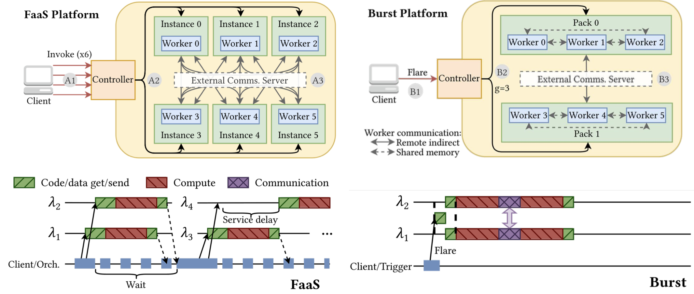

# ATC 2025

## Meta Info

Homepage: [https://www.usenix.org/conference/atc25](https://www.usenix.org/conference/atc25)

Paper list: [https://www.usenix.org/conference/atc25/technical-sessions](https://www.usenix.org/conference/atc25/technical-sessions)

### Acceptance Rate

15.8% (= 100 / 634)

## Papers

### Large Language Models (LLMs)

* LLM Training
  * GreyHound: Hunting Fail-Slows in Hybrid-Parallel Training at Scale \[[Paper](https://www.usenix.org/conference/atc25/presentation/wu-tianyuan)] \[[Video](https://www.youtube.com/watch?v=R_YsYdY8MPc)] \[[Code](https://github.com/wutianyuan1/Greyhound)]
    * HKUST & Alibaba
    * Takeaways of the characterization study.
      * Fail-slows are usually transient, primarily caused by degradation in computation (slow GPUs or CPU contention) and communication (network congestion).
      * Computation fail-slows tend to be short-lived and less frequent; communication fail-slows due to network congestion are more common and tend to last longer.
      * As training scales up, the likelihood of simultaneously encountering multiple performance issues increases.
    * **GreyHound-Detect**
      * Use the Bayesian online change-point detection (BOCD) algorithm and a verification check to differentiate between real fail-slow issues and normal performance jitters.
      * Change-point verification: compare the average iteration time before and after each identified change-point, treating it as a jitter if the difference is less than 10%.
    * **GreyHound-Mitigate**
      * Ski-rental-like multi-level straggler mitigation → Begin with a low-cost strategy and progressively switch to more effective and more costly strategies if fail-slow persists and the current approach proves ineffective.
      * Adjust the number of micro-batches allocated to DP groups according to their computation performance.
      * Adjust the parallelism topology to reduce congestion and minimize PP stages affected by stragglers.
  * CrossPipe: Towards Optimal Pipeline Schedules for Cross-Datacenter Training \[[Paper](https://www.usenix.org/conference/atc25/presentation/chen-tiancheng)] \[[Video](https://www.youtube.com/watch?v=V9dXZJukgNY)] \[[Slides](https://www.usenix.org/sites/default/files/conference/protected-files/atc25_slides_kubicek_ales.pdf)] \[[Code](https://github.com/spcl/crosspipe)]
    * ETH
    * Present a latency and bandwidth-aware performance model designed for the cross-DC environment.
    * PP is better than DP in cross-DC training.
    * Decouple block scheduling from communication arrangement.
  * Obscura: Concealing Recomputation Overhead in Training of Large Language Models with Bubble-filling Pipeline Transformation \[[Paper](https://www.usenix.org/conference/atc25/presentation/huang-yuzhou)] \[[Slides](https://www.usenix.org/sites/default/files/conference/protected-files/atc25_slides-huang_yuzhou.pdf)] \[[Video](https://www.youtube.com/watch?v=rygp733JlVU)]
    * SYSU
    * Leverage pipeline transformation to better conceal recomputation overhead.
  * Optimus: Accelerating Large-Scale Multi-Modal LLM Training by Bubble Exploitation \[[Paper](https://www.usenix.org/conference/atc25/presentation/feng)] \[[Video](https://www.youtube.com/watch?v=vR8rwNyBGYo)]
    * Harvard & ByteDance & USC
    * Schedule the encoder computation within the LLM bubbles.
  * FlexPipe: Maximizing Training Efficiency for Transformer-based Models with Variable-Length Inputs \[[Paper](https://www.usenix.org/conference/atc25/presentation/zhao-hairui)] \[[Video](https://www.youtube.com/watch?v=h0Wqp1pOb90)]
    * Jilin University & UC Riverside
    * Dynamically adjust PP by a live flexibility mechanism.
* LLM Inference
  * DeepServe: Serverless Large Language Model Serving at Scale \[[Paper](https://www.usenix.org/conference/atc25/presentation/hu-junhao)] \[[Video](https://www.youtube.com/watch?v=Ol1g-rn_uNQ)]
    * PKU & Huawei Cloud
  * Weaver: Efficient Multi-LLM Serving with Attention Offloading \[[Paper](https://www.usenix.org/conference/atc25/presentation/gao)] \[[Video](https://www.youtube.com/watch?v=3mYpyoapZZA)] \[[Slides](https://www.usenix.org/sites/default/files/conference/protected-files/atc25_slides_gao_shiwei.pdf)]
    * THU
    * Opportunity: offload attention from hot to cold instances.
    * Challenge 1: The offloaded attention is blocked by many pre-issued kernels
      * Solution: **GPU-driven control flow**
      * Pipeline: The sender (hot model) writes QKV results in _GPU shared memory_ & updates task counter → The receiver (cold model) executes a _polling kernel_ to select a task → The receiver writes the output in GPU shared memory & updates completion counter → The sender waits for the output.
    * Challenge 2: The offloaded task is blocked by a single long-running kernel.
      * Solution: **Operator splitting**
      * Pipeline: Sort by the operator's running time → Split the biggest operator into two halves and insert back → Reinsert into the queue & repeat until the waiting time < threshold
  * Toppings: CPU-Assisted, Rank-Aware Adapter Serving for LLM Inference \[[Paper](https://www.usenix.org/conference/atc25/presentation/li-suyi-toppings)]
    * HKUST & CUHK-SZ & TeleAI & Huawei Cloud
    * A system to serve many LoRA adapters derived from a common base model.
    * Pin the base model on GPUs and dynamically load the requested LoRA adapters from host memory as new requests arrive.
    * Use CPUs to compute the lightweight adaptation for prefilling & switch to the GPUs after loading completes to resume the remaining computation.
    * Schedule heterogeneous LoRA requests to maximize the SLO attainment.
  * QFactory: Accelerating Quantized Large Language Model Serving with Qtile Graphs \[[Paper](https://www.usenix.org/conference/atc25/presentation/zhang-qihao)] \[[Video](https://www.youtube.com/watch?v=zrSYfZUNoGQ)] \[[Artifact](https://github.com/zqh-wz/QFactory-AE)]
    * THU
    * A compilation framework to generate high-performance _quantized kernels_.
    * Transform the traditional tensor computation graph into a Qtile-graph (Qgraph)
    * Explore graph-level Qtile computation transformations to generate equivalent QGraphs.
    * Employ operator-level Qtile scheduling to identify optimal memory loading strategies for each Qtile within the QGraph before generating the final code.
  * CLONE: Customizing LLMs for Efficient Latency-Aware Inference at the Edge \[[Paper](https://www.usenix.org/conference/atc25/presentation/tian)] \[[Video](https://www.youtube.com/watch?v=CNQfMAQOpVs)] \[[Slides](https://www.usenix.org/sites/default/files/conference/protected-files/atc25_slides-tian.pdf)]
    * Macau
    * Offline device-specific tailoring
      * LLM layers contribute unevenly to effectiveness and efficiency → Fine-grained layer-wise tuning.
    * Online latency-aware inference
      * Request-wise MoE-based router → Dynamically merge LoRA modules for each mixed-task prompt.
      * Learning-based DVFS (Dynamic Voltage and Frequency Scaling) controller → Reduce per-generated token energy consumption while satisfying the real-time latency target at the layer-wise level.
* LLM Fine-Tuning
  * JENGA: Enhancing LLM Long-Context Fine-tuning with Contextual Token Sparsity \[[Paper](https://www.usenix.org/conference/atc25/presentation/wang-tuowei)] \[[Slides](https://www.usenix.org/sites/default/files/conference/protected-files/atc25_slides_wang_tuowei.pdf)] \[[Video](https://www.youtube.com/watch?v=6JKYFlXD47g)] \[[Artifact](https://github.com/Pairshoe/Jenga-AE)]
    * THU & MSRA
    * Exploit a new token-level sparsity mechanism inherent in long-context scenarios.
  * mTuner: Accelerating Parameter-Efficient Fine-Tuning on Multi-GPU Servers with Elastic Tensor \[[Paper](https://www.usenix.org/conference/atc25/presentation/huang-kezhao)] \[[Video](https://www.youtube.com/watch?v=J2RmtTfgPqQ)] \[[Code](https://github.com/xxcclong/mTuner)]
    * THU
    * **Elastic Tensor**, an abstraction for dynamic tensor management → Enable flexible control over their availability, accumulation, and release in memory.
* Resource Multiplexing
  * Resource Multiplexing in Tuning and Serving Large Language Models \[[Paper](https://www.usenix.org/conference/atc25/presentation/he-yongjun)] \[[Video](https://www.youtube.com/watch?v=DIohHO_HZgI)] \[[Artifact](https://github.com/llm-db/llmstation/tree/atc25-artifact)]
    * ETH
    * **LLMStation**
      * A new iteration-level multitasking scheduling mechanism.
      * An Autograd engine to transform a tuning task into a suspendable pipeline.
      * An inference engine to batch inference and tuning requests.
* KV Cache Management
  * KVCache Cache in the Wild: Characterizing and Optimizing KVCache Cache at a Large Cloud Provider \[[Paper](https://www.usenix.org/conference/atc25/presentation/wang-jiahao)] \[[Slides](https://www.usenix.org/sites/default/files/conference/protected-files/atc25_slides_zhang_dingyan.pdf)] \[[Video](https://www.youtube.com/watch?v=A6PuiR-BMis)] \[[Trace](https://github.com/alibaba-edu/qwen-bailian-usagetraces-anon)]
    * SJTU IPADS & Alibaba Cloud
    * Key takeaways from the characterization study
      * KV$ reuses are common, but the reuse ratio is smaller than previously reported numbers on synthetic datasets.
      * For each specific request category, the reuse time is predictable based on the historical information.
      * The lifespan of KV$ is ephemeral.
* SpMM
  * GeneralSparse: Bridging the Gap in SpMM for Pruned Large Language Model Inference on GPUs \[[Paper](https://www.usenix.org/conference/atc25/presentation/wang-yaoyu)] \[[Slides](https://www.usenix.org/sites/default/files/conference/protected-files/atc25_slides-wang_yaoyu.pdf)] \[[Video](https://www.youtube.com/watch?v=5nWI7d2NR-4)] \[[Code](https://github.com/Wangyaoyuu/GeneralSparse)]
    * ICT, CAS
    * Pruned weight + batch size of dense matrix → SpMM program
  * Voltrix: Sparse Matrix-Matrix Multiplication on Tensor Cores with Asynchronous and Balanced Kernel Optimization \[[Paper](https://www.usenix.org/conference/atc25/presentation/xia)] \[[Video](https://www.youtube.com/watch?v=SPReaFs5_DE)]
    * WHU & NVIDIA & Macau

### Mixture-of-Experts (MoE)

* MoE Training
  * PopFetcher: Towards Accelerated Mixture-of-Experts Training Via Popularity Based Expert-Wise Prefetch \[[Paper](https://www.usenix.org/conference/atc25/presentation/zhang-junyi)] \[[Slides](https://www.usenix.org/sites/default/files/conference/protected-files/atc25_slides-zhang_junyi.pdf)] \[[Video](https://www.youtube.com/watch?v=A0mlhNrv1yg)]
    * HUST
    * Prefetch high-demand experts in the next layer during the execution of current non-MoE computations.
    * Prioritize All-to-All communication stream over All-Reduce operation among prefetched experts.

### Diffusion Models

* Katz: Efficient Workflow Serving for Diffusion Models with Many Adapters \[[Paper](https://www.usenix.org/conference/atc25/presentation/li-suyi-katz)] \[[Video](https://www.youtube.com/watch?v=izS_8clIHvA)] \[[Slides](https://www.usenix.org/sites/default/files/conference/protected-files/atc25_slides_yang_lingyun.pdf)] \[[Code](https://github.com/modelscope/Katz)] \[[Trace](https://modelscope.cn/datasets/mental2008/T2I-Model-Serving-Request-Trace)]
  * HKUST & Alibaba
  * **Our work!**
  * ControlNet-as-a-Service → Enable ControlNet caching, parallelization, and sharing.
  * Bounded Asynchronous Loading (BAL) → Overlap LoRA loading with initial base model execution by a maximum of K steps.
  * Latent parallelism → Accelerate base model execution across multiple GPUs.

### Deep Learning Recommendation Models (DLRMs)

* DLRM Training
  * Primus: Unified Training System for Large-Scale Deep Learning Recommendation Models \[[Paper](https://www.usenix.org/conference/atc25/presentation/shan-jixi)] \[[Slides](https://www.usenix.org/sites/default/files/conference/protected-files/atc25_slides_shan_jixi.pdf)]
    * ByteDance
    * Unified resource scheduling
      * Unified API-server upon a diverse cluster.
      * Provide both dynamic horizontal and vertical scaling mechanisms.
      * Standardize YARN & Kubernetes scheduling semantics.
    * Unified data orchestration
      * Support batch and stream data mixture with a three-tier data definition (Dataset, Data Stream, Data Source).
      * Provide a graph-based task planner to accelerate training task generation.
    * Unified training paradigm
      * Mixture Training Recommendation Model (MTRM), a new model with memory and adaptive towers to handle catastrophic forgetting and delayed feedback.

### Deep Learning Compilation

* PluS: Highly Efficient and Expandable ML Compiler with Pluggable Graph Schedules \[[Paper](https://www.usenix.org/conference/atc25/presentation/wu-ruofan)] \[[Video](https://www.youtube.com/watch?v=mXBifQoegGg)]
  * RUC & Microsoft & THU

### GPU Sharing

* Efficient Performance-Aware GPU Sharing with Compatibility and Isolation through Kernel Space Interception \[[Paper](https://www.usenix.org/conference/atc25/presentation/zhang-shulai)] \[[Video](https://www.youtube.com/watch?v=e54BVwcdJ4Y)]
  * SJTU & Lenovo
  * **Krypton**
  * Intercept GPU command buffers at the kernel level to provide virtual GPU devices.
  * The hardware units are divided using MIG, while time slices and device memory are allocated using the kernel-space scheduler.
* GPreempt: GPU Preemptive Scheduling Made General and Efficient \[[Paper](https://www.usenix.org/conference/atc25/presentation/fan)] \[[Slides](https://www.usenix.org/sites/default/files/conference/protected-files/atc25_slides_fan.pdf)] \[[Video](https://www.youtube.com/watch?v=bFGHPHqT35o)] \[[Code](https://github.com/thustorage/GPreempt)]
  * THU
  * Implement a timeslice-based yield mechanism to enable context-switch preemption on GPUs.
  * Employ a hint-based pre-preemption technique to overlap the preemption process with the essential data-preparation phase.
* Colocating ML Inference and Training with Fast GPU Memory Handover \[[Paper](https://www.usenix.org/conference/atc25/presentation/wang-jiali)] \[[Slides](https://www.usenix.org/sites/default/files/conference/protected-files/atc25_slides_wang_jiali_0.pdf)] \[[Video](https://www.youtube.com/watch?v=0o6xvkKQDOI)] \[[Code](https://github.com/SiriusInfTra/Sirius)]
  * SJTU IPADS
  * Key insight: training task is elastic and reconfigurable; transfer memory between training and inference by reconfiguring training tasks (i.e., changing batch size).

### Cloud Computing

* Serverless Computing
  * Torpor: GPU-Enabled Serverless Computing for Low-Latency, Resource-Efficient Inference \[[Paper](https://www.usenix.org/conference/atc25/presentation/yu)] \[[Video](https://www.youtube.com/watch?v=a2RUtZCuyyA)] \[[Code](https://github.com/FCSLab/torpor)]
    * CUHK-SZ & HKUST & Alibaba & Nokia Bell Labs
    * Maintain models in main memory and dynamically swap them onto GPUs upon request arrivals.
    * Several techniques to minimize latency overhead caused by model swapping: Asynchronous API redirection, GPU runtime sharing, pipelined model execution, and efficient GPU memory management.
  * Burst Computing: Quick, Sudden, Massively Parallel Processing on Serverless Resources \[[Paper](https://www.usenix.org/conference/atc25/presentation/barcelona-pons)] \[[Slides](https://www.usenix.org/sites/default/files/conference/protected-files/atc25_slides_barcelona-pons_daniel.pdf)] \[[Video](https://www.youtube.com/watch?v=3T1I0jgWh5o)] \[[Code](https://github.com/Burst-Computing)]
    * Universitat Rovira i Virgili & Barcelona Supercomputing Center
    * Key principle: **group awareness**.
    *

        <figure><figcaption></figcaption></figure>
* Image provisioning
  * Poby: SmartNIC-accelerated Image Provisioning for Coldstart in Clouds \[[Paper](https://www.usenix.org/conference/atc25/presentation/chang)] \[[Slides](https://www.usenix.org/sites/default/files/conference/protected-files/atc25_slides_chang_zihao.pdf)] \[[Video](https://www.youtube.com/watch?v=xjxGNdodyx4)] \[[Artifact](https://github.com/ACS-Innov/ATC2025-Poby)]
    * ICT, CAS
    * Disaggregated architecture
      * Orchestrate resources of the entire cluster to accelerate image provisioning.
    * Pipeline-based data-driven workflow
      * Pipeline the workflow to enhance efficiency.
      * Eliminate the overhead of control messages.
    * Distributed image download
      * Image metadata index (IMI) records all images and node info.
      * Keep all IMIs in memory.

### Data Preprocessing

* HyCache: Hybrid Caching for Accelerating DNN Input Preprocessing Pipelines \[[Paper](https://www.usenix.org/conference/atc25/presentation/jha)] \[[Video](https://www.youtube.com/watch?v=kZ41xCyAlKM)]
  * IISc & USC
  * Enable the caching of subsets of preprocessed data from multiple intermediate steps on both memory and storage.

### POSIX Shell

* The Koala Benchmarks for the Shell: Characterization and Implications \[[Paper](https://www.usenix.org/conference/atc25/presentation/lamprou)] \[[Video](https://www.youtube.com/watch?v=4YsdRy_S1gA)] \[[Homepage](https://kben.sh/)] \[[Benchmark Suite](https://github.com/kbensh/koala)]
  * Brown University
  * **Best Paper Award**
  * 14 sets of real-world shell programs from diverse domains ranging from CI/CD and AI/ML to biology and the humanities.

## Acronyms

* LoRA: Low-Rank Adaptation
* MoE: Mixture-of-Experts
* PP: Pipeline Parallelism
* DP: Data Parallelism
* SpMM: Sparse-dense Matrix Multiplication
