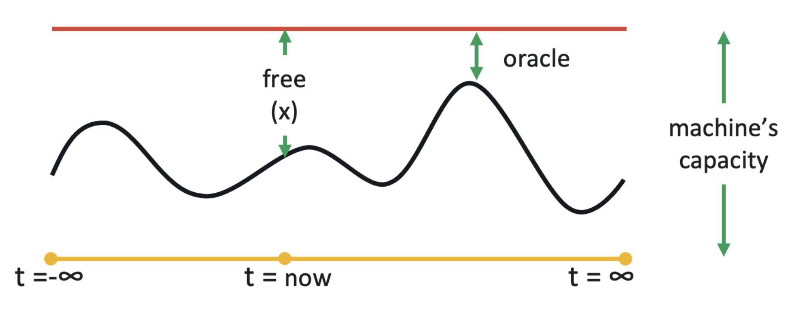

# Take it to the limit: Peak prediction-driven resource overcommitment in datacenters

## Metadata

Presented in [EuroSys 2021](https://doi.org/10.1145/3447786.3456259).

Authors: Noman Bashir, Nan Deng, Krzysztof Rzadca, David Irwin, Sree Kodak, Rohit Jnagal (_University of Massachusetts Amherst_ & _Google_)

Code (simulator): [https://github.com/googleinterns/cluster-resource-forecast](https://github.com/googleinterns/cluster-resource-forecast)

## Understanding the paper

This paper focuses on **the problem of resource overcommitment**.

### Question

Assuming the **complete knowledge** of each task’s **future resource usage**, what is the **safest** overcommit policy that yields the **highest utilization**?

This work formalizes the overcommitment problem as **the problem of predicting peak usage on each machine**, which is complementary and orthogonal to scheduling problem.

### Peak Oracle

<figure><figcaption>
Peak Oracle
</figcaption></figure>

They implement peak oracle in **simulation** (historical data owns complete knowledge) and use it to evaluate practical peak predictors.

The predictors should be **lightweight** and **fast** to compute.

### Predictors in the paper

* borg-default
  * Inspired by Borg
  * peak = fraction of sum of **limits** (e.g., 90%)
* RC-like
  * Inspired by Resource Central
  * peak = sum(x %ile of tasks **usage**)
* N-sigma
  * Based on central limit theorem
  * peak = mean + N times STD (consider **usage**)
* max(predictors)
  * peak = max(peaks across predictors)
  * Eventually, this paper chooses this predictor, which combines RC-like and N-sigma.

### My takeaways

1. Propose a general methodology (peak oracle) for designing and evaluating overcommit policies.
2. Complementary and orthogonal to the cluster scheduling algorithm.
3. Oversubscribe serving tasks with other serving tasks.
4. Demonstrate that the max predictor policy is less risky and more efficient.
