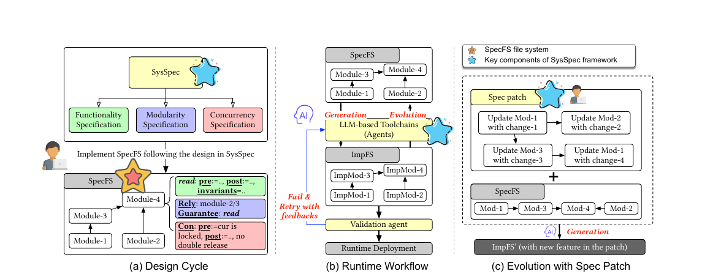

# Sharpen the Spec, Cut the Code: A Case for Generative File System with SYSSPEC

## Meta Info

Presented in [FAST 2026](https://www.usenix.org/conference/fast26/presentation/liu-qingyuan).

Authors: Qingyuan Liu, Mo Zou, Hengbin Zhang, Dong Du, Yubin Xia, Haibo Chen (_SJTU_)

Awards: **Best Paper**; **Distinguished Artifact Award**

Resources: [Paper](https://www.usenix.org/conference/fast26/presentation/liu-qingyuan), [PDF](https://www.usenix.org/system/files/fast26-liu-qingyuan.pdf), [arXiv](https://arxiv.org/abs/2512.13047), [Code](https://github.com/SJTU-IPADS/specfs), [Homepage](https://llmnativeos.github.io/specfs/), [Slides](https://www.usenix.org/system/files/fast26_slides_liu-qingyuan.pdf), [Video](https://www.youtube.com/watch?v=aMxAPuYhAkk)

## Understanding the paper

### TL;DR

**SYSSPEC** makes the specification—not generated code—the source of truth for a file system. Developers describe behavior, module contracts, and concurrency; LLM agents generate and evolve the C implementation. Its main insight is that structured, composable specifications make whole-system generation more reliable than natural-language prompts or source-code context alone.

The motivation comes from Ext4's history: 82.4% of 3,157 commits are bug fixes or maintenance, while only 5.1% add features. File-system development is therefore mainly an evolution problem: many small changes must preserve invariants across tightly coupled modules.

### Key design

<figure><figcaption>
SYSSPEC separates system design, implementation generation and validation, and specification-level evolution.
</figcaption></figure>

SYSSPEC separates three concerns:

* **Functionality** uses pre-/post-conditions, invariants, and optional algorithm or intent descriptions. Contracts state exactly which transitions are valid; algorithms constrain performance-sensitive choices that functional correctness alone cannot distinguish.
* **Modularity** keeps each module within the model's context window and connects modules through `Rely`/`Guarantee` contracts. Generation sees required interfaces and behaviors without loading the entire codebase.
* **Concurrency** specifies lock ownership and ordering separately. SpecCompiler first generates sequential logic, then instruments synchronization in a second pass, reducing a difficult synthesis problem into two narrower ones.

Evolution uses **DAG-structured spec patches**. Leaf nodes introduce local changes and new guarantees; intermediate nodes regenerate affected dependents; root nodes preserve the old external guarantee and become safe replacement points. The DAG records both change impact and generation order instead of asking an agent to rediscover dependencies from code.

SpecCompiler generates modules and retries with feedback from a separate SpecEval role. SpecValidator combines specification review with compilation and regression tests. SpecAssistant helps refine draft specifications. These agents mitigate hallucination; they do not prove correctness.

### Evidence

**SPECFS** is a 45-module, approximately 4.3-KLoC concurrent in-memory FUSE file system based on AtomFS's design. Gemini 2.5 Pro and DeepSeek V3.1 Reasoning generate all 45 evaluated modules correctly; an oracle baseline that sees dependency implementations reaches 81.8% with Gemini.

The ablation is the clearest evidence for the design. Functionality specifications alone generate 12/40 concurrency-agnostic modules. Adding modularity reaches 40/40. For five thread-safe modules, functionality plus modularity reaches 0/5; concurrency specifications raise this to 4/5, and SpecValidator closes the gap to 5/5. The authors also evolve SPECFS with 10 Ext4-derived features.

### Caveats

* SYSSPEC is **formal-method-inspired, not formally verified**: structured natural language, LLM review, and tests replace a theorem prover.
* The specification becomes the trusted artifact. Missing invariants or dependency changes can produce consistently wrong code.
* SPECFS is a userspace, in-memory prototype without direct disk access or crash consistency. The work demonstrates specification-driven generation and evolution, not a production replacement for Ext4.
