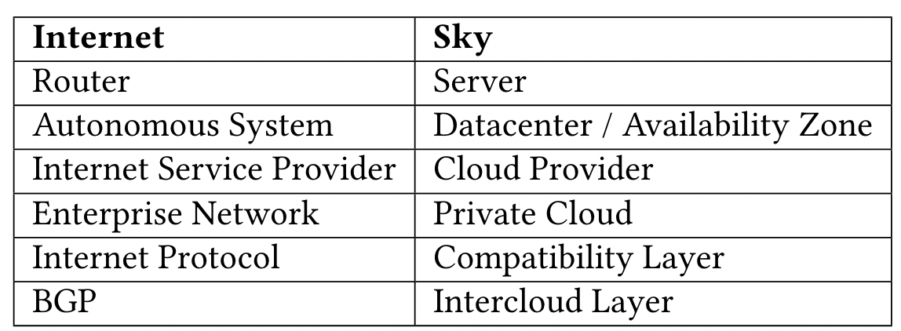

# From cloud computing to sky computing

## Metadata

Presented in [HotOS 2021](https://doi.org/10.1145/3458336.3465301).

Authors: Ion Stoica, Scott Shenker

## Understanding the paper

Very exciting paper! This paper suggests steps we can take to overcome this differentiation and help create a more commoditized version of cloud computing, i.e., sky computing. The barriers are more economic than technical.

### Background

What is cloud computing? Users have access to massive amounts of computation and storage and charged only for the resources they use.

### Current situation

Cloud providers strive to differentiate themselves through proprietary services.

### Limitation of previous works

Previous designs of sky computing focus on particular technical solutions and target specific workloads.

### Key points

#### Analogy between the Internet and Sky Computing

What we need in sky computing:

1. **A compatibility layer**: mask low-level technical differences.
2. **An intercloud layer**: route jobs to the right cloud.
3. **A peering laye**r: allow cloud to have agreements with each other about how to exchange services.

#### Compatibility layer

Most users interact mostly with **higher level management and service interfaces**. A growing number of them are supported by **open source software (OSS)**.

On purely technical grounds, achieving a widely usable compatibility layer is **easily achievable**.

While the compatibility layer has **clear benefits for users**, the cloud providers may not be interested.

#### Intercloud layer

Akin to requiring an Internet user to explicitly select the AS paths for its interdomain traffic.

The intercloud layer must **allow users to specify policies about where their jobs should run**, but not require users to make low-level decisions about job placement.

#### Peering layer

Today, most clouds have pricing policies where **moving data into a cloud** is much _cheaper_ than **moving it out**. It creates a strong incentive for users to **process data in the same cloud** in which it currently resides. But in some cases moving jobs is still worthwhile.

Why not clouds enter into reciprocal data peering arrangements, where they agree to **allow free exporting of data to each other** and to **connect with high-speed links**?

#### About the future

Once a compatibility layer and an intercloud layer are in place, cloud providers will fall into two categories:

1. **Stand-alone** cloud providers
   * Lock customers in with proprietary interfaces and data export fees.
   * Large enough to offer a variety of proprietary services.
2. **Sky** cloud providers
   * Directly support the compatibility layer.
   * Agree to reciprocal data peering with other commodity cloud providers.
   * Specialize in supporting one or more services.

Some thoughts from the authors:

* In the long term, we will continue to have both kinds of providers.
* Smaller cloud providers are more expected to embrace the compatibility layer.
* The collective sky can counterbalance the large proprietary clouds and allow them to focus their innovation efforts more narrowly.
