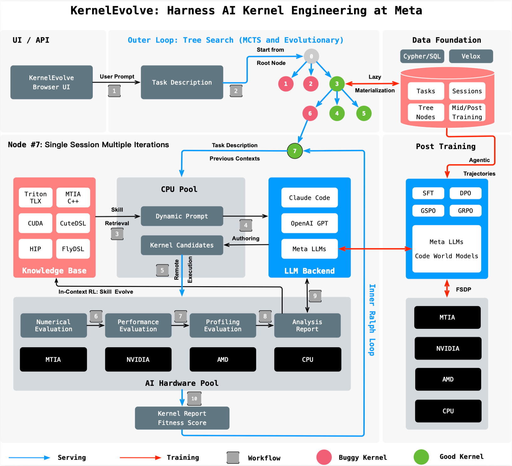

# KernelEvolve: Scaling Agentic Kernel Coding for Heterogeneous AI Accelerators at Meta

## Meta Info

Presented in [arXiv:2512.23236](https://arxiv.org/abs/2512.23236).

Authors: KernelEvolve Team (_Meta_)

Resources: [Blog](https://engineering.fb.com/2026/04/02/developer-tools/kernelevolve-how-metas-ranking-engineer-agent-optimizes-ai-infrastructure/)

## Understanding the paper

### TL;DR

* KernelEvolve is an agentic kernel coding system for recommendation-model training and inference across NVIDIA GPUs, AMD GPUs, Meta MTIA chips, and CPUs.
* The core idea is to formulate kernel generation as a graph/tree search problem instead of one-shot code generation.
  * The system iteratively generates candidate kernels, evaluates them, retrieves hardware-specific knowledge, and feeds diagnostics back into the next round of synthesis.
* It closes the loop with a strong tooling stack.
  * Correctness and speed are validated automatically with TritonBench and cross-stack profilers such as Torch Profiler, NCU, Proton, and MTIA Insight.
* The reported outcomes are strong.
  * 100% pass rate on all 250 KernelBench tasks.
  * 100% correctness on 160 ATen operators across three hardware platforms.
  * Up to 17x speedup over PyTorch baselines on production kernels, while shrinking optimization time from weeks to hours.

### Background

* The paper focuses on Meta's DLRM and ranking workloads.
  * These workloads span multiple model generations, from embedding-heavy recommenders to sequence-learning models and more recent large-scale ranking models.
* Kernel optimization has a three-dimensional explosion.
  * Hardware diversity: NVIDIA GPUs, AMD GPUs, MTIA, and multiple hardware generations.
  * Model diversity: different recommendation architectures need different operators.
  * Kernel diversity: many production operators are custom preprocessing, fusion, or ranking-specific kernels outside vendor libraries.
* This makes manual kernel tuning a bottleneck.
  * A kernel optimized for one hardware generation may not transfer well to another.
  * Vendor libraries and compiler autotuning can cover common kernels, but they do not fully cover the long tail of production operators.

### Challenges

* Hardware heterogeneity
  * Different accelerators expose different memory hierarchies, instruction sets, execution models, and profiling tools.
  * Proprietary hardware such as MTIA is absent from public LLM training corpora, so a generic coding assistant lacks the required hardware knowledge.
* Model and operator diversity
  * Production recommendation systems use many workload-specific operators, including data preprocessing and fused business logic, which makes the search space much larger than standard GEMM/conv tuning.
* Cross-stack optimization difficulty
  * Useful performance signals are fragmented across Triton/DSL code, compiler IR, runtime traces, and low-level hardware counters.
  * A practical kernel-coding agent needs an automated way to correlate these signals and use them in the next search iteration.

### Existing approaches

* Vendor libraries
  * Libraries such as cuBLAS and cuDNN work well for standard operators, but they do not solve the long tail of custom ranking kernels.
* Compiler autotuning and fusion
  * These approaches help explore scheduling and fusion spaces, but still struggle to cover the full combination of shapes, hardware targets, and custom operators at Meta's scale.
* One-shot LLM code generation
  * A single draft is usually not enough for kernel optimization because correctness bugs, profiling bottlenecks, and hardware-specific constraints must be resolved iteratively.

### Designs

<figure><figcaption>
KernelEvolve system architecture and optimization workflow.
</figcaption></figure>

* **Search formulation**
  * KernelEvolve models the optimization process as a search graph.
  * Each node is a kernel artifact, each edge is a transformation, and the system repeatedly applies selection, transformation, and fitness evaluation.
  * The paper mentions multiple search strategies, including greedy search, Monte Carlo Tree Search (MCTS), and evolutionary algorithms.
* **LLM synthesizer with dynamic prompts**
  * The system generates kernels across multiple abstractions, from Triton and CuTe-style DSLs to lower-level backends such as CUDA, HIP, and MTIA C++.
  * Prompts are not static templates. They are enriched online with runtime diagnostics, retrieved hardware knowledge, and prior search history.
* **Agentic retrieval and context management**
  * A deep-search sub-agent retrieves relevant documents, code samples, and optimization guidance from a persistent knowledge base.
  * A context-memory sub-agent decides what historical context from the search tree should be kept for the next iteration.
  * This lets the search inherit useful parent/sibling information while still being able to restart and escape local optima.
* **Knowledge injection for proprietary hardware**
  * The knowledge base stores correctness constraints, platform-agnostic optimization guidance, and hardware-specific documentation.
  * For MTIA, the system injects architecture manuals, instruction references, memory hierarchy information, and optimization patterns at inference time.
  * This is the key mechanism that makes code generation feasible even on hardware unseen during LLM pretraining.
* **Evaluation and debugging loop**
  * TritonBench checks correctness against PyTorch references and measures speedup.
  * Torch Profiler captures system-level timelines.
  * NCU, Proton, and MTIA Insight provide lower-level kernel and hardware-counter views.
  * Meta's MPP (Multi-Pass Profiler) acts as the federated tooling layer that unifies instrumentation, profiling, and trace synthesis across the stack.

### Implementation

* KernelEvolve is organized as a long-running optimization harness rather than an interactive one-shot coding assistant.
* The system stores both metadata and kernel artifacts across optimization runs.
  * Metadata records parent-child relations, quality scores, and whether a candidate is buggy.
  * The object store preserves generated kernels and analysis reports so later runs can reuse prior optimization history.
* The paper also positions the system as self-improving.
  * Successful optimization patterns can be distilled back into the shared knowledge base.
  * Optimization sessions also create structured trajectories that can be reused for post-training smaller domain-specific models.

### Evaluation

* OSS operator coverage
  * KernelEvolve generates Triton kernels for 160 ATen operators on H100, MI350, and MTIA v3.
  * It achieves 100% correctness across all 480 operator-platform combinations.
  * On KernelBench, it reaches a 100% pass rate across all three difficulty levels.
* Search behavior
  * The paper separates the search into a draft phase and a tree-expansion phase.
  * Early iterations sample candidates without memory, while later iterations exploit execution feedback from ancestors to refine promising directions.
* Production case studies
  * Across production workloads, the paper reports 1.2x-17x speedups over PyTorch baselines.
  * For the convolutional-transformer case on H100, KernelEvolve achieves 2.30x over `torch.conv1d` and 1.62x over the optimized `conv2d` workaround on the main FP16 production shape.
  * The main win comes from kernel fusion and eliminating extra layout-conversion kernels rather than only improving raw convolution throughput.
* End-to-end business impact
  * The accompanying Meta blog reports over 60% inference throughput improvement for the Andromeda ads model on NVIDIA GPUs.
  * It also reports over 25% training throughput improvement for an ads model on MTIA.

### Limitations and future work

* The optimized kernels can be highly shape-specialized.
  * In the 1D convolution case study, kernels tuned for production shapes underperform on some out-of-distribution shapes.
* The system still depends on high-quality evaluation infrastructure.
  * Cross-stack profiling, correctness checking, and hardware-specific diagnostics are essential to make the search effective.
* New hardware still requires curated documentation.
  * KernelEvolve reduces the work from hand-writing kernels to curating hardware knowledge, but this knowledge-injection step remains necessary.
* The broader opportunity is larger than kernel coding.
  * The blog and paper suggest extending the same agentic loop to compiler optimization, memory management, and other system-tuning problems.
