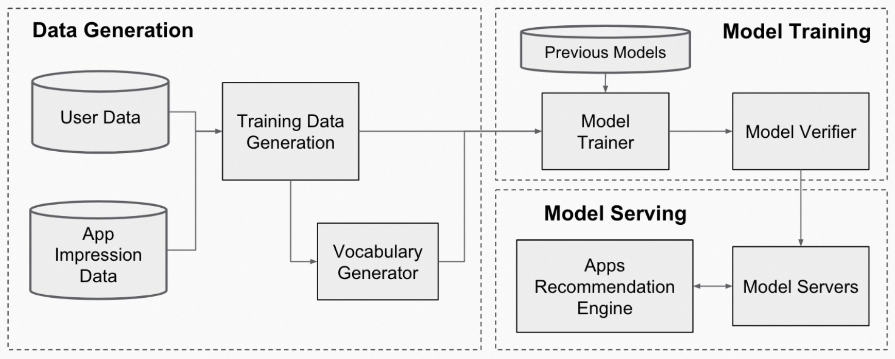

# A unified architecture for accelerating distributed DNN training in heterogeneous GPU/CPU clusters

## Meta Info

Presented in [OSDI 2020](https://www.usenix.org/conference/osdi20/presentation/jiang).

Authors: Yimin Jiang (_THU & ByteDance_), Yibo Zhu (_ByteDance_), Chang Lan (_Google_), Bairen Yi (_ByteDance_), Yong Cui (_THU_), Chuanxiong Guo (_ByteDance_).

Code: [https://github.com/bytedance/byteps](https://github.com/bytedance/byteps)

## Understanding the paper

This paper presents a distributed DNN training architecture called **BytePS**.

It leverages _spare CPU and bandwidth resources_ in the cluster to accelerate distributed DNN training tasks.

It outperforms the state-of-the-art open-source _all-reduce_ and _PS_.

### Observation

* There are _spare CPUs and bandwidth_ in production GPU clusters.
* Existing _all-reduce_ and _PS_ architectures are insufficient.
  * They do not utilize additional CPU and bandwidth resources well.

### Architecture

* Two main modules
  * _Summation Service (SS)_
    * Receive tensors from CS; sum them up; send them back to CS.
  * _Communication Service (CS)_
    * (Internally) synchronize the tensors among the local GPUs
    * (Externally) communicate with SS

<figure><figcaption>
BytePS architecture.
</figcaption></figure>

### Communication design

* Inter-machine communication
  * The summation workload determines the _network traffic_.
  * Partition the tensors into small parts no longer than 4MB.
  * Use RDMA RoCEv2.
  * Each machine has _one 100GbE NIC_.
* Intra-machine communication
  * PCIe-only topology
    * _CPU-assisted aggregation_
      * Let GPUs under the same PCIe switch sum the tensors.
      * Copy to CPU and let CPU do the global summation.
      * Broadcast back the global sum.
    *

        <figure><figcaption>
PCIe-only machine topology and BytePS data flow.
</figcaption></figure>
  * NVLink-based topology
    * _Reduce_ tensors from all GPUs to _GPU2_.
    * Copy the results to CPU memory from _GPU2_.
    * After CS gets the aggregated results from SS, _GPU2_ copy the data into GPU memory and broadcast them to other GPUs.
    * Prevent GPUs from using _the P0 - CPU0 bandwidth_ for communication, so _the NIC can run to full 100Gbps bandwidth_.
    *

        <figure><figcaption>
NVLink-based machine topology and BytePS data flow.
</figcaption></figure>
  * **Two principles**
    * Avoid direct GPU-to-GPU memory copy when the two GPUs are _not_ under the same PCIe switch.
    * Minimize traffic on the PCIe switch to the CPU link that is _shared by GPUs and NIC_.
* GPUDirect RDMA (GDR)
  * Limitation
    * GDR _requires the GPU and the RDMA NIC to be on the same PCIe switch_, otherwise, the throughput can be less than 50Gbps even with 100GbE NIC.
    * _PCIe-only topology_ cannot meet the requirements, while _NVLink-based topology_ has avoided any PCIe bottlenecks.
    * Most clouds like AWS do not support GDR.
  * Result: BytePS _does not use GDR for now_.

### Notes

> The CPU machines may not necessarily be actual CPU-only machines. For example, our in-house cluster scheduler can _allocate CPUs on the GPU machines_ that run non-distributed jobs and have spare CPU cores and network bandwidth. This improves the overall cluster resource utilization.

> The problem is that the topology is not symmetric considering the NIC, which is connected to only one (out of four) PCIe switch.
