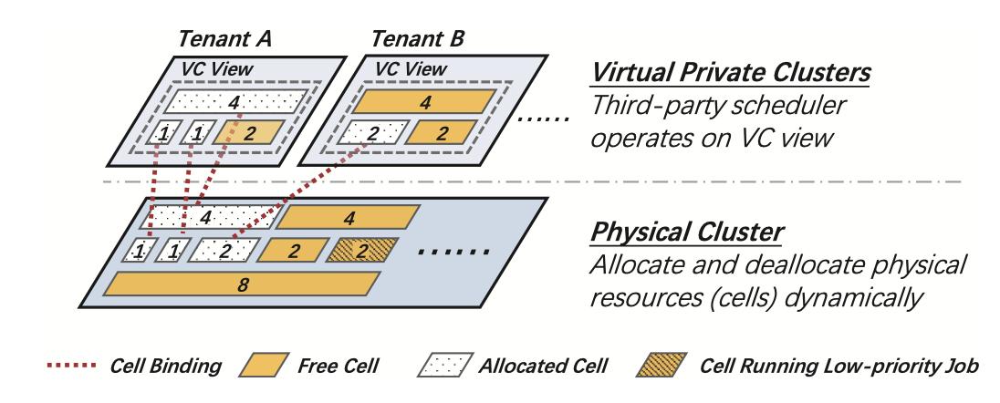

# HiveD: Sharing a GPU cluster for deep learning with guarantees

## Metadata

Presented in [OSDI 2020](https://www.usenix.org/conference/osdi20/presentation/zhao-hanyu). \[ [Paper](https://www.usenix.org/system/files/osdi20-zhao\_hanyu.pdf) | [Slides](https://www.usenix.org/sites/default/files/conference/protected-files/osdi20\_slides\_zhao.pdf) | [Video](https://www.youtube.com/watch?v=WYGxAZHccts) | [Code](https://github.com/microsoft/hivedscheduler) ]

Authors: Hanyu Zhao, Zhenhua Han, Zhi Yang, Quanlu Zhang, Fan Yang, Lidong Zhou, Mao Yang, Francis C.M. Lau, Yuqi Wang, Yifan Xiong, Bin Wang

## Understanding the paper

### Key motivation

The authors observe that some tenants may experience **worse queueing delay** in **multi-tenant GPU clusters** than **a private cluster** with allocated shares of GPUs (i.e., _quota_).

The main question is that _**quota**_ **cannot guarantee the a desirable GPU** _**affinity**_ for each deep learning jobs. Multi-GPU jobs have to wait in a queue or run at a relaxed affinity.

To ensure sharing safety, HiveD **reserves GPU affinity explicitly**.

### Limitation of existing solutions

Currently, there is no framework to consider sharing anomaly in multi-tenant GPU clusters.

### Strong points

* HiveD is **the first framework to address sharing anomaly** in multi-tenant GPU clusters. It defines a hierarchical cell structure, and each cell is a set of GPUs at a certain level of affinity. Each tenant reserves resources via a **Virtual Private Cluster (VC)**, which has multi-level cells, as shown in the figure.
  * Level-1 cell: GPU
  * Level-2 cell: PCI-e switch (2 GPUs)
  * Level-3 cell: CPU socket (4 GPUs)
  * Level-4 cell: Node (8 GPUs)
  * Level-5 cell: Rack (multi-node)

* HiveD separates **resource reservation** and **resource allocation** (which is determined by schedulers). Therefore, it can easily incorporate any state-of-the-art deep learning scheduler (e.g., YARN-CS, Gandiva, Tiresias), which means that each VC can apply a diverse scheduler to achieve different objectives (e.g., cluster utilization, job completion time, fairness).
* HiveD has been open-sourced and integrated in [OpenPAI](https://github.com/microsoft/pai).
* HiveD can be extended to **other affinity-aware resources** (e.g., NUMA-aware resources like affinitized GPUs and CPU cores under the same socket).

### Weak points

**VC assignment**

As for me, it's hard to determine the VC assignment to each tenant, specially the cell structures of GPUs. In the paper, Sec. 6 mentions this as a business process. Systems have to consider many factors, including overall capacity, tenant demands, composition of tenant workload, workload variation over time, business priority, budget constraints. But HiveD leaves the difficult problem to users.

### Implementation

HiveD is implemented in 7,700+ lines of **Go** codes. It is implemented as a _scheduler extender_, a standalone process that works in tandem with the Kubernetes default scheduler.

HiveD is deployed as a Kubernetes StatefulSet to ensure a single running instance. And it partitions and stores the cell binding decision for each pod in its "pod annotation".

### Evaluation

1. Experiments on a 96-GPU cluster on a public cloud
   * Deployed on Azure.
   * The cluster consists of 24 VMs, each with 4 NVIDIA K80 GPUs.
2. Trace-driven simulations on a production workload (i.e., Philly trace).

Choose three types of deep learning models: CV, NLP, and Speech (WaveNet, DeepSpeech).

## Questions

* How to define if a tenant suffers from sharing anomaly in the multi-tenant cluster?
  * In the trace, the GPU _affinity_ requirements of most jobs are hard. Therefore, the authors use queueing delay to evaluate the cluster sharing anomaly. They also evaluate the JCT when job's affinity requirement is soft.

