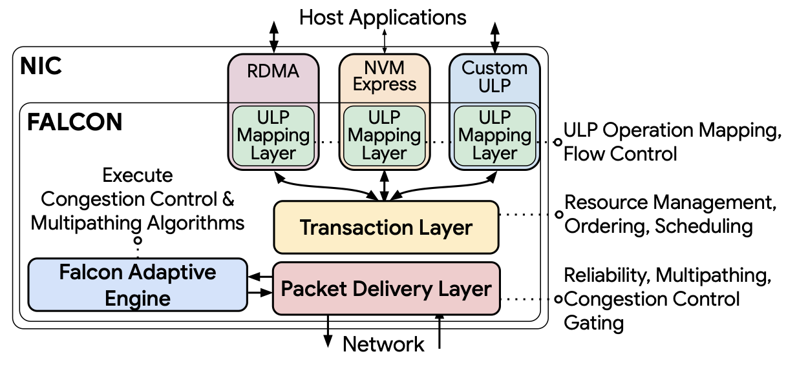

# SIGCOMM 2025

## Meta Info

Homepage: [https://conferences.sigcomm.org/sigcomm/2025/](https://conferences.sigcomm.org/sigcomm/2025/)

### Paper List

* [https://conferences.sigcomm.org/sigcomm/2025/accepted-papers/](https://conferences.sigcomm.org/sigcomm/2025/accepted-papers/)
* [https://dl.acm.org/doi/proceedings/10.1145/3718958](https://dl.acm.org/doi/proceedings/10.1145/3718958)

### Acceptance Rate

16% (= 74 / 460 (approx.))

## Papers

### Large Language Models (LLMs)

* Infrastructure
  * InfiniteHBD: Building Datacenter-Scale High-Bandwidth Domain for LLM with Optical Circuit Switching Transceivers \[[Paper](https://dl.acm.org/doi/10.1145/3718958.3750468)] \[[Video](https://www.youtube.com/watch?v=d4PX36vVDX0)]
    * PKU & StepFun & Lightelligence
    * Key insight: unify connectivity and dynamic switching at the transceiver level using OCS.
    * Realize the transceiver-centric HBD architecture in production → Flexible construction of arbitrarily large ring topologies & improved system resilience
      * Silicon Photonics (SiPh) based OCS transceiver (OCSTrx)
      * Reconfigurable k-hop ring topology → Each node connects to all other nodes within ≤𝐾 hops via OCSTrx
      * HBD-DCN orchestration algorithm → Minimize cross-ToR traffic
  * Astral: A Datacenter Infrastructure for Large Language Model Training at Scale \[[Paper](https://dl.acm.org/doi/10.1145/3718958.3750521)] \[[Video](https://www.youtube.com/watch?v=Ou389tkXL1I)]
    * NJU & Tencent
* LLM Training
  * DistTrain: Addressing Model and Data Heterogeneity with Disaggregated Training for Multimodal Large Language Models \[[Paper](https://dl.acm.org/doi/10.1145/3718958.3750472)] \[[Video](https://www.youtube.com/watch?v=O_qdjBsLwE8)] \[[arXiv](https://arxiv.org/abs/2408.04275)]
    * PKU & StepFun
    * Disaggregated model orchestration: separate the training for modality encoder (ViT for images, Beats for audios), LLM backbone, and modality generator (Diffusion for images, AudioLDM for audio).
    * Disaggregated data preprocessing: decouple data preprocessing from training.
    * Integrated with Megatron-LM.
  * ByteScale: Communication-Efficient Scaling of LLM Training with a 2048K Context Length on 16384 GPUs \[[Paper](https://dl.acm.org/doi/10.1145/3718958.3754352)] \[[Video](https://www.youtube.com/watch?v=cXsMyc7ROyo)]
    * PKU & ByteDance
    * Limitations of existing works
      * The mismatch between data heterogeneity & static mesh → Redundant communication and imbalanced computation.
    * **HDP**: Hybrid Data Parallelism
      * Unify the inter- and intra-data partitioning with a dynamic mesh design.
      * A communication optimizer
        * Eliminate the redundant communication for _short sequences_ by _data-aware sharding_ and _dynamic communication_.
        * Compress the communication cost for _long sequences_ by _selective offloading_.
      * A balance scheduler → Mitigate the imbalanced computation by _parallelism-aware data assignment_.
  * From ATOP to ZCube: Automated Topology Optimization Pipeline and A Highly Cost-Effective Network Topology for Large Model Training \[[Paper](https://dl.acm.org/doi/10.1145/3718958.3750503)] \[[Video](https://www.youtube.com/watch?v=7fVx3b1T_dc)]
    * THU & Zhongguancun Laboratory & Harnets.AI & ByteDance
    * ATOP: Automated Topology Optimization Pipeline
      * Model network topology as a set of hyperparameters → Enable the discovery of potential network topologies.
    * A new topology ZCube, discoverd by ATOP.
      * Reach the highest cost-effectiveness across various GPU scale.
  * SkeletonHunter: Diagnosing and Localizing Network Failures in Containerized Large Model Training \[[Paper](https://dl.acm.org/doi/10.1145/3718958.3750513)] \[[Video](https://www.youtube.com/watch?v=s1hPuZ033Nk)]
    * THU & Alibaba Cloud
    * Key idea: reason about the traffic skeleton, which comprises a crucial set of network paths consistently traversed by the training traffic.
* Privacy-preseving LLM Inference
  * SCX: Stateless KV-Cache Encoding for Cloud-Scale Confidential Transformer Serving \[[Paper](https://dl.acm.org/doi/10.1145/3718958.3750509)] \[[Video](https://www.youtube.com/watch?v=isix2nPNkyI)] \[[Code](https://github.com/yuanmu97/scx)]
    * CUHK
    * Encode the intermediate key-value cache using user-controlled keys → Ensure that the cloud can neither recover the input nor independently complete the next token prediction.
* LLMOps
  * Intent-Driven Network Management with Multi-Agent LLMs: The Confucius Framework \[[Paper](https://dl.acm.org/doi/10.1145/3718958.3750537)] \[[Video](https://www.youtube.com/watch?v=QpCXjseK0HQ)]
    * Meta
    * Model network management workflows as DAGs to aid planning.
    * Integrate LLMs with existing _management tools_ to achieve seamless operational integration, employ RAG to improve long-term memory, and establish a set of primitives to systematically support _human/model interaction_.
    * Integrate with existing _network validation_ methods and incorporate its own validation framework to prevent regressions.
  * Towards LLM-Based Failure Localization in Production-Scale Networks \[[Paper](https://dl.acm.org/doi/10.1145/3718958.3750505)] \[[Video](https://www.youtube.com/watch?v=95NQmZrTwbk)]
    * NJU & Alibaba Cloud
    * BiAn (狴犴), an LLM-based framework for efficient incident investigation.
    * Process monitoring data and generate error device rankings with detailed explanations.

### Mixture-of-Experts (MoEs)

* MoE Training
  * MixNet: A Runtime Reconfigurable Optical-Electrical Fabric for Distributed Mixture-of-Experts Training \[[Paper](https://dl.acm.org/doi/10.1145/3718958.3750465)] \[[Video](https://www.youtube.com/watch?v=zYVtGsWzAjI)]
    * HKUST
    * Design and implement a regionally reconfigurable HBD that augments existing electrical interconnects using OCS.
* MoE Inference
  * MegaScale-Infer: Efficient Mixture-of-Experts Model Serving with Disaggregated Expert Parallelism \[[Paper](https://dl.acm.org/doi/10.1145/3718958.3750506)] \[[Video](https://www.youtube.com/watch?v=eXHC8OpI2hk)] \[[arXiv](https://arxiv.org/abs/2504.02263)]
    * PKU & ByteDance
    * Attention/FFN Disaggregation (AFD)
    * Provide a M2N communication library → Eliminate unnecessary GPU-to-CPU data copies, group initialization overhead, and GPU synchronization.

### RDMA

* Reliability
  * Revisiting RDMA Reliability for Lossy Fabrics \[[Paper](https://dl.acm.org/doi/10.1145/3718958.3750480)] \[[Video](https://www.youtube.com/watch?v=4CgsjKMJ1Ns)]
    * HKUST & Huawei
    * **Best Student Paper Award (Honorable Mention)**
    * DCP co-designs the switch and RNICs, including DCP-Switch and DCP-RNIC.
      * Header-only-based retransmission.
      * Bitmap-free packet tracking.
    * Prototype DCP-Switch using P4 switch and DCP-RNIC using FPGA.
* Virtualization
  * Software-based Live Migration for RDMA \[[Paper](https://dl.acm.org/doi/10.1145/3718958.3750487)] \[[Video](https://www.youtube.com/watch?v=_JTZhc6wYxo)]
    * THU & MSRA
    * MigrRDMA: a software-based RDMA live migration.
    * Provide a software indirection layer to achieve transparent switching to new RDMA communications.
    * Implemented over Mellanox RNICs.
  * ByteDance Jakiro: Enabling RDMA and TCP over Virtual Private Cloud \[[Paper](https://dl.acm.org/doi/10.1145/3718958.3750496)] \[[Video](https://www.youtube.com/watch?v=gh13ILZGY1s)]
    * ByteDance
    * Support fundamental VPC features (e.g., QoS, security groups) for both RDMA and TCP streams.
  * Alibaba Stellar: A New Generation RDMA Network for Cloud AI \[[Paper](https://dl.acm.org/doi/10.1145/3718958.3750539)] \[[Video](https://dl.acm.org/doi/10.1145/3718958.3750539)]
    * Alibaba Cloud
    * Limitations of existing RDMA virtualization solutions (e.g., SR-IOV)
      * Host-level
        * The number of VFs is static → Cannot dynamically scale the number of VFs.
        * The container must pin all of its memory in the host memory before initiating any RDMA operation → A minute-level start-up delay.
      * PCIe-level
        * LUT in PCIe fabrics is severely limited in size → Only a small number of VFs to enable GDR.
      * RNIC-level
        * No support for strict isolation between RDMA and non-RDMA traffic.
    * Three designs
      * Para-Virtualized Direct Memory Access (**PVDMA**) for on-demand memory pinning → Reduce host memory consumption & mitigate the start-up delay of secure containers.
      * Extended Memory Translation Table (**eMTT**) for optimized GDR performance → Allow the RNIC to bypass unnecessary consultations of memory address mappings in the PCIe fabric.
      * RDMA Packet Spray for efficient multi-path utilization
* Performance Diagnosis
  * Hawkeye: Diagnosing RDMA Network Performance Anomalies with PFC Provenance \[[Paper](https://dl.acm.org/doi/10.1145/3718958.3750490)] \[[Video](https://www.youtube.com/watch?v=wp5h3cFMXsk)]
    * THU & BUAA & Infrawaves
    * Three designs
      * A PFC-aware telemetry mechanism → Record the PFC impact on flows
      * An in-network PFC causality analysis and tracing mechanism → Collect causal telemetry for diagnosis
      * A provenance-based diagnosis algorithm → Present the anomaly breakdown, identify the anomaly type and root causes
    * Evaluated on both NS-3 simulations and a Tofino testbed.
* I/O Acceleration
  * CEIO: A Cache-Efficient Network I/O Architecture for NIC-CPU Data Paths \[[Paper](https://dl.acm.org/doi/10.1145/3718958.3750488)] \[[Video](https://www.youtube.com/watch?v=yMJG4m56-eo)] \[[Code](https://github.com/axio-project/ceio)]
    * HKUST
    * Limitations of traditional I/O acceleration strategies (e.g., Data Direct I/O (DDIO), RDMA)
      * Inefficient utilization of the LLC.
    * Cache-efficient I/O → Line-rate throughput and µs-scale tail latency
      * Limit I/O Rate → Proactive rate control
      * Limit I/O Capacity → Elastic buffer
    * Implemented on commodity SmartNICs and incorporated into DPDK and RDMA libraries.

### Hardware Transport

* Falcon: A Reliable, Low Latency Hardware Transport \[[Paper](https://dl.acm.org/doi/10.1145/3718958.3754353)] \[[Video](https://www.youtube.com/watch?v=nu18DsuvnlU)]
  * Google
  * Support multiple Upper Layer Protocols (ULPs) and heterogeneous application workloads in general-purpose Ethernet datacenter environments (with losses and without special switch support).
  * Key designs: delay-based congestion control with multipath load balancing, a layered design with a simple request-response transaction interface for multi-ULP support, hardware-based retransmissions and error-handling for scalability, a programmable engine for flexibility.
  *

      <figure><figcaption>
Falcon hardware transport layers
</figcaption></figure>

### Collective Communication

* ResCCL: Resource-Efficient Scheduling for Collective Communication \[[Paper](https://dl.acm.org/doi/10.1145/3718958.3750514)] \[[Video](https://www.youtube.com/watch?v=uu594-CfWNE)]
  * NEU & SIAT, CAS & Alibaba Cloud
  * Limitations of existing works (e.g., NCCL, RCCL, MSCCL)
    * Static resource allocation and scheduling mechanisms → Inefficient utilization of bandwidth and SM resources for various collective algorithms
  * Three designs
    * Optimize scheduling at the primitive level (e.g., send and recvReduceCopy).
    * Enable flexible thread block allocation.
    * Generate lightweight communication kernels to minimize runtime overhead.
* SyCCL: Exploiting Symmetry for Efficient Collective Communication Scheduling \[[Paper](https://dl.acm.org/doi/10.1145/3718958.3750499)] \[[Video](https://www.youtube.com/watch?v=x1vL9SbcZmE)]
  * Alibaba Cloud & THU
  * Limitations of existing works
    * Existing collective communication libraries (e.g., NCCL, RCCL) rely on fixed schedules and cannot adjust to varying topology and model requirements.
    * Existing collective schedule synthesizers (e.g., TECCL, TACCL) utilize Mixed Integer Linear Program for modeling but encounter scalability challenges.
  * SyCCL, a scalable collective schedule synthesizer → Synthesize near-optimal schedules in tens of minute.
    * Leverage collective and topology symmetries to decompose the original collective communication demand into smaller sub-demands within smaller topology subsets.
    * Propose efficient search strategies to explore potential sub-demands, synthesizes corresponding sub-schedules, and integrates these sub-schedules into complete schedules.

### Video Streaming

* Towards User-level QoE: Large-scale Practice in Personalized Optimization of Adaptive Video Streaming \[[Paper](https://dl.acm.org/doi/10.1145/3718958.3750526)] \[[Video](https://www.youtube.com/watch?v=vWqnKwmlkwQ)]
  * THU & Kuaishou & SFU
  * **LingXi**, a system for personalized adaptive video streaming.
    * Dynamically optimize the objectives of adaptive video streaming algorithms by analyzing user engagement.
    * Iteratively determine optimal parameters through Monte Carlo sampling and online Bayesian optimization.
* TLadder: QoE-Centric Video Ladder Optimization with Playback Feedback at Billion Scale \[[Paper](https://dl.acm.org/doi/10.1145/3718958.3750500)] \[[Video](https://www.youtube.com/watch?v=pKPHFzR3Cww)]
  * ByteDance
  * Jointly consider the video content dimension (i.e., the bitrate-quality tradeoff of candidate representations) and the playback feedback dimension (e.g., network condition, rebuffering time, and playback bitrate).
* ACE: Sending Burstiness Control for High-Quality Real-time Communication \[[Paper](https://dl.acm.org/doi/10.1145/3718958.3750520)] \[[Video](https://www.youtube.com/watch?v=_c8fOxVZsAU)]
  * HKUST & ByteDance
  * A dual-control approach that manages both the encoding and transmission burstiness.
    * Sender: dynamically adjust the bucket size of a token-based pacer to control burstiness at the granularity of frame level.
    * Encoder: an adaptive complexity mechanism that smoothens frame sizes without sacrificing quality.
* Harnessing WebRTC for Large-Scale Live Streaming \[[Paper](https://dl.acm.org/doi/10.1145/3718958.3750535)] \[[Video](https://www.youtube.com/watch?v=Bf_zTLZ2C5w)]
  * ByteDance
  * Focus on optimizing first-frame delay, startup video rebuffering, audio-to-video drift, and per-session CPU usage.
* Scalable Video Conferencing Using SDN Principles \[[Paper](https://dl.acm.org/doi/10.1145/3718958.3750489)] \[[Video](https://www.youtube.com/watch?v=_8v9ZTrFkZI)] \[[Code](https://github.com/princeton-cabernet/scallop)]
  * Princeton & UVA
  * **Scallop**, an SDN-inspired SFU (Selective Forwarding Unit)
    * Decouple video-conferencing applications into a hardware-based data plane for latency-sensitive and frequent media operations.
  * A software control plane for the (infrequent) remaining tasks (e.g., analyze feedback signals, session management).

### CXL

* Understanding and Profiling CXL.mem Using PathFinder \[[Paper](https://dl.acm.org/doi/10.1145/3718958.3750479)] \[[Video](https://www.youtube.com/watch?v=PHqrdRGRfD4)] \[[Code](https://github.com/netlab-wisconsin/PathFinder)]
  * UW-Madison & BUAA & Intel
  * Leverage the capabilities of existing PMUs and dissect the `CXL.mem` protocol at adequate granularities.
  * Key idea: view the server processor and its chipset as a multi-stage Clos network, equip each architectural module with a PMU-based telemetry engine, track different `CXL.mem` paths, and apply conventional traffic analysis techniques.
  * Perform snapshot-based path-driven profiling and introduce four techniques: path construction, stall cycle breakdown, interference analyzer, and cross-snapshot analysis.
  * Built atop Linux Perf.

### Network Failures

* SkyNet: Analyzing Alert Flooding from Severe Network Failures in Large Cloud Infrastructures \[[Paper](https://dl.acm.org/doi/10.1145/3718958.3750536)] \[[Video](https://www.youtube.com/watch?v=3NhCnKqgBtM)]
  * Alibaba Cloud
  * Extract scope and severity information from alert floods.
  * Integrate multiple monitoring data sources through a uniform input format.

## Acronyms

* RDMA: Remote Direct Memory Access
* OCS: Optical Circuit Switching
* HBD: High-Bandwidth Domain
* DCN: Datacenter Network
* ToR: Top-of-Rack
* VPC: Virtual Private Cloud
* SR-IOV: Single-Root Input/Output Virtualization
* GDR: GPUDirect RDMA
* VF: Virtual Function
* LUT: Look-Up Table
* LLC: Last-Level Cache
* CXL: Compute Express Link
* PMU: Performance Monitoring Unit
* WebRTC: Web Real-Time Communications
* DAG: Directed Acyclic Graph
* RAG: Retrieval-Augmented Generation
