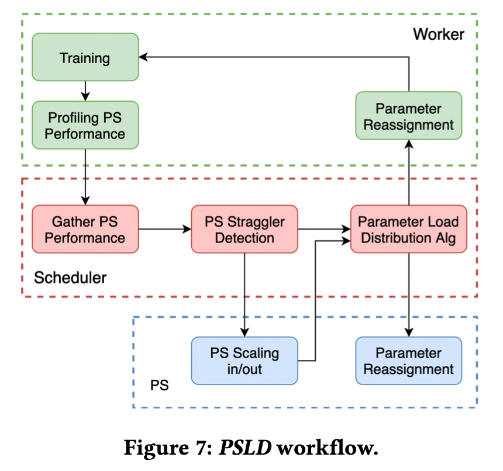

# Elastic Parameter Server Load Distribution in Deep Learning Clusters

## Metadata

Presented in [SoCC '20](https://dl.acm.org/doi/10.1145/3419111.3421307). \[ [Paper](https://dl.acm.org/doi/pdf/10.1145/3419111.3421307) ]

Authors: Yangrui Chen, Yanghua Peng, Yixin Bao, Chuan Wu, Yibo Zhu, Chuanxiong Guo

## Understanding the paper

A work across HKU and ByteDance.

### Motivation

* Parameter servers (PS) are widely used in distrubuted DNN training. But their performance will be damanged by **stragglers** because of some reasons (e.g., _imbalanced parameter distribution_, _bandwidth contention_, or _computation interference_).
* **Few** existing studies have investigated **efficient parameter (aka load) distribution** among parameter servers (PS).

### Solution

* Propose a **dynamic** parameter server load distribution scheme called **PSLD**.
  * Mitigate PS straggler issues and accelerate distributed model training.
  * An _exploitation-exploration_ method is used to 1) scale in and out parameter servers, 2) adjust parameter distribution among PSs.
  * Implemented on BytePS and vanilla MXNet PS architectures.

Not read the details of the algorithms.
