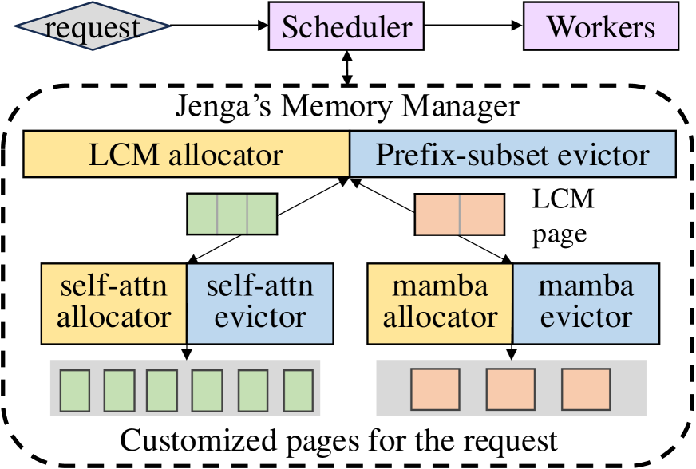

# Jenga: Effective Memory Management for Serving LLM with Heterogeneity

## Meta Info

Presented in [SOSP 2025](https://dl.acm.org/doi/10.1145/3731569.3764823).

Authors: Chen Zhang, Kuntai Du, Shu Liu, Woosuk Kwon, Xiangxi Mo, Yufeng Wang, Xiaoxuan Liu, Kaichao You, Zhuohan Li, Mingsheng Long, Jidong Zhai, Joseph Gonzalez, Ion Stoica (_THU, UChicago, UC Berkeley_)

## Understanding the paper

### TL;DR

Jenga is a KV-cache memory manager for LLM serving under heterogeneous model architectures. The core idea is to generalize PagedAttention's fixed-page abstraction into an attention-property-aware allocator: an LCM-sized compatible page layer for sharing memory across heterogeneous cache types, and per-type small-page allocators plus evictors for self-attention, sliding-window attention, Mamba states, vision embeddings, and multi-model/speculative-decoding caches.

Jenga's key contribution is not only smaller memory fragmentation. It also gives each layer type a way to define its own cache-hit and eviction semantics, while a global prefix-subset evictor keeps evictions balanced and aligned across layer types. This lets serving engines reclaim memory that fixed full-prefix KV-cache assumptions would keep unnecessarily.

### Background

* LLM serving throughput is often constrained by GPU memory, because larger batches require storing KV caches for all active requests.
* PagedAttention reduces fragmentation by mapping logical KV-cache pages to physical pages, but it assumes:
  * Fixed-size embeddings: every token/layer cache object fits the same page-size abstraction.
  * Full-prefix dependency: the next token depends on the whole prefix, so all prefix tokens share the same lifecycle.
* Modern LLM architectures break both assumptions:
  * Sparse/sliding-window attention only needs a recent prefix subset in some layers.
  * Mamba/state-space layers maintain large recurrent states instead of per-token KV for every prefix token.
  * VLMs combine text-token KV cache, image-token KV cache, and vision embedding cache with different sizes and lifecycles.
  * Speculative decoding and multi-model serving maintain caches for draft and target models with different sizes.

### Key observations

* Heterogeneous cache sizes cause memory fragmentation.
  * A fixed page size that matches one cache type can waste memory for another cache type.
  * For VLMs, allocating both image-token and text-token KV cache for all layers wastes memory because self-attention layers need text-token KV while cross-attention layers need image-token KV.
* Heterogeneous token dependencies change prefix caching.
  * Self-attention requires all prefix tokens to remain cached for a prefix hit.
  * Sliding-window attention only requires the tokens inside the current window.
  * Mamba layers may only cache sparse recurrent states, such as every fixed interval of tokens.
  * Vision embedding caches should prefer evicting whole images instead of scattering evictions across many images, because one missing image token can force recomputing the vision encoder.
* Eviction across layer types must satisfy two properties:
  * Balanced eviction: no layer type should evict so aggressively that it becomes the bottleneck for model-wide prefix hits.
  * Aligned eviction: different layer types should evict similar token sets, otherwise the union of evicted tokens destroys cross-layer prefix-cache hits.

### Design

<figure><figcaption>
Overview of Jenga's two-level memory manager.
</figcaption></figure>

* Two-level memory allocation
  * Compatibility layer: partition the KV-cache memory into large pages whose size is the least common multiple (LCM) of all relevant cache object sizes.
  * Customization layer: each layer/cache type divides large pages into its own small pages, such as pages for self-attention KV, sliding-window KV, Mamba states, or vision embeddings.
  * This keeps a fixed exchange granularity across cache types while allowing each type to use an appropriate local page size.
* Request-aware allocation
  * Jenga tries to allocate small pages belonging to the same request from the same large page.
  * When a request finishes, those small pages tend to become free together, so the whole large page can be returned to the LCM allocator.
  * This reduces internal fragmentation inside large pages.
* Execution-compatible memory layout
  * Standard PagedAttention uses a layer-page layout.
  * Jenga switches to a page-layer layout so that each small page is contiguous and can be exchanged across cache types.
  * Existing PagedAttention kernels can still be reused by passing per-layer `kv_cache_start_ptr`, `page_size_exec`, and `pageid_exec`; Jenga does not require new CUDA attention kernels.
* Customizable prefix caching
  * `update_last_access` lets a layer type customize which pages should be considered recently used.
  * `set_prefix_length` lets a layer type align eviction priority across pages that represent the same logical prefix.
  * `get_possible_prefix` lets a layer type define which prefixes are valid cache hits given the current cached/missing-token bitmap.
* Prefix-subset evictor
  * A global evictor coordinates the customized per-layer evictors.
  * For cache hit, it asks every layer type for valid prefixes and chooses the longest common prefix that is valid for all layer types.
  * For eviction, it keeps last-access timestamps and prefix-length priorities coordinated so that different layer types evict compatible token sets.

### Layer-specific policies

* Sliding-window attention
  * Updates last-access time only for tokens inside the sliding window.
  * Allows prefix hits as long as the required recent window tokens remain cached.
  * Prioritizes evicting tokens outside the active window.
* Mamba layers
  * Avoids caching every token because Mamba states are large.
  * Caches sparse states, such as every 512 tokens in the prototype.
  * Exposes valid hit prefixes through `get_possible_prefix`.
* Vision embedding and cross-attention cache
  * Treats vision embedding cache as another heterogeneous cache type.
  * For chunked prefill, frees or reuses vision embeddings after they have been consumed by the LLM part.
  * Uses image-level eviction priority so recomputation tends to be concentrated on fewer images.
* Speculative decoding and multi-model serving
  * Handles draft-model and target-model KV caches as different cache types.
  * Uses the same compatible large-page layer to share memory across models with different KV-cache sizes.

### Implementation

* Implemented on top of vLLM.
* Around 4K lines of Python in the arXiv prototype.
* No CUDA kernel changes are required.
* The prototype parses model structures to discover possible embedding/cache sizes and configure memory allocation automatically.
* The arXiv prototype reports compatibility with all 90 models supported by vLLM v0.6.4.

### Evaluation

* Setup
  * Platforms: NVIDIA H100 80GB and NVIDIA L4 24GB.
  * Baseline: vLLM with only the memory-management subsystem changed.
  * Models include Llama 3.2 Vision, Gemma-2, Ministral, Jamba-1.5, a character.ai-style model, PyramidKV, and standard Llama.
  * Datasets include MMLU-pro, MMMU-pro, and long-context arXiv-QA workloads.
* End-to-end serving
  * The SOSP version reports up to 83% GPU memory-utilization improvement and up to 2.16x serving-throughput improvement, 1.46x on average.
  * Jenga preserves latency under low load, and improves latency under higher load because it can admit larger batches.
* Fragmentation breakdown
  * On Ministral traces, vLLM wastes a large fraction of KV-cache memory because it keeps sliding-window-layer KV for tokens outside the window.
  * Jenga reduces this waste by independently allocating self-attention and sliding-window KV cache and dynamically shifting memory between them.
* Prefix caching
  * For workloads with repeated articles and different questions, customized sliding-window eviction improves cache hit rate because old tokens outside the window can be evicted first.
  * Higher hit rate reduces recomputation and improves throughput.
* VLM chunked prefill
  * Jenga caches vision embeddings so the vision encoder does not need to rerun for each chunked-prefill step.
  * The arXiv prototype reports 1.88x throughput improvement and 1.60x latency improvement for this case.
* Speculative decoding
  * Jenga automatically manages different cache sizes for draft and target models.
  * It reaches the manually designed allocation performance for homogeneous Llama-style speculative decoding, and improves heterogeneous speculative decoding without model-specific allocator redesign.

### Limitations and discussion

* The LCM large-page size can become large when cache object sizes have unfavorable ratios. The paper argues this is manageable for models supported by vLLM v0.6.4, but this remains an engineering risk for future architectures.
* Jenga focuses on memory management inside the serving engine. It complements, rather than replaces, scheduling, offloading, KV compression, and distributed serving optimizations.
* Prefix-cache policy quality depends on exposing correct layer-specific dependency rules. New attention variants still need corresponding small policy implementations.
* Multi-model serving beyond speculative decoding is discussed as a natural extension, but full general support is left as future work.
