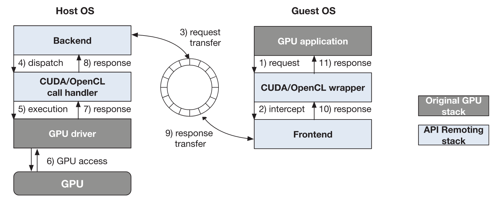

# GPU virtualization and scheduling methods: A comprehensive survey

## Metadata

Presented in [CSUR 2017](https://doi.org/10.1145/3068281).

Authors: Cheol-Ho Hong, Ivor Spence, Dimitrios S. Nikolopoulos (_Queen’s University Belfast_)

## Understanding the paper

GPU virtualization can be implemented on **three approaches**.

### **API remoting**

* **Library-level**.
* This approach provides **a GPU wrapper library** to guest OS to intercept GPU calls.
* The intercepted calls are forwarded to the host OS or a remote machine with GPUs.
* The requests will be processed remotely and the results are returned to the guest OS.
* The core difficulty is that **the GPU driver implementation is not open source**.

<figure><figcaption>
Architecture of the API remoting approach
</figcaption></figure>

### **Para & full virtualization**

* **Drivel-level**.
* This approach uses **a custom GPU driver** based on **the available documentation** to realize GPU virtualization at the driver level.
* NVIDIA-related **reverse engineering** is required.

<figure><figcaption>
Architecture of the full or para virtualization approach
</figcaption></figure>

### **Hardware-supported virtualization**

* **Hardware-level**.
* This approach requires that a guest OS is given direct access to GPUs with **hardware extension features**.
* For example, NVIDIA GRID allows some GPUs to be multiplexed.

<figure><figcaption>
Architecture of the hardware-supported approach
</figcaption></figure>
