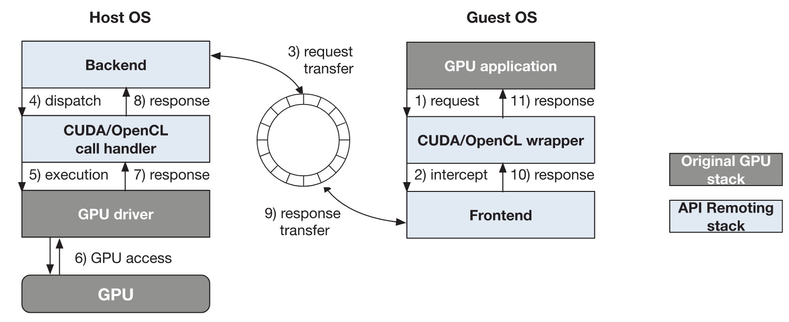
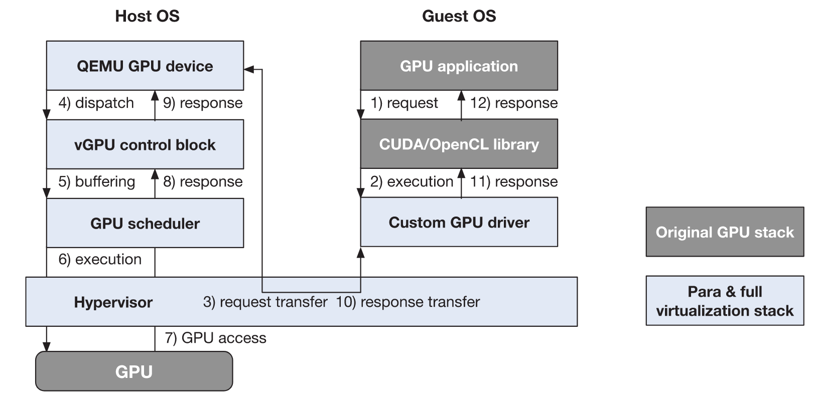
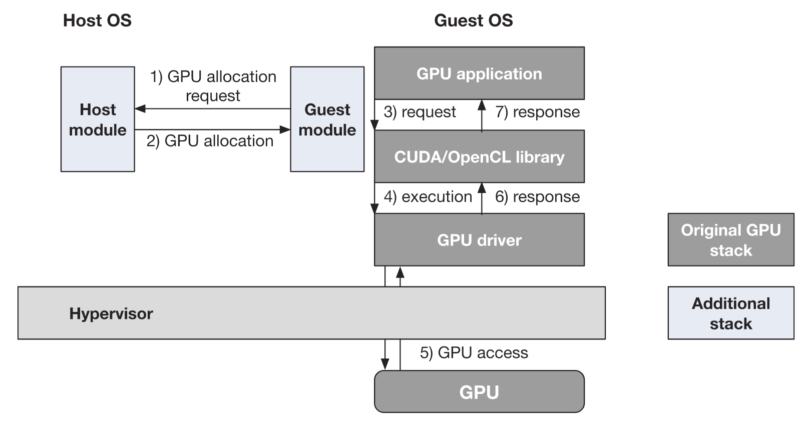

# GPU virtualization and scheduling methods: A comprehensive survey

## Metadata

Presented in [ACM Computing Surveys 2017](https://doi.org/10.1145/3068281).

Authors: Cheol-Ho Hong, Ivor Spence, Dimitrios S. Nikolopoulos

## Understanding the paper

GPU virtualization can be implemented on three approaches:

1. **API remoting**
   * **Library-level**.
   * This approach provides **a GPU wrapper library** to guest OS to intercept GPU calls.
   * The intercepted calls are forwarded to the host OS or a remote machine with GPUs.
   * The requests will be processed remotely and the results are returned to the guest OS.
   * The core difficulty is that **the GPU driver implementation is not open source**.
   * 
2. **Para & full virtualization**
   * **Drivel-level**.
   * This approach uses **a custom GPU driver** based on **the available documentation** to realize GPU virtualization at the driver level.
   * NVIDIA-related **reverse engineering** is required.
   * 
3. **Hardware-supported virtualization**
   * **Hardware-level**.
   * This approach requires that a guest OS is given direct access to GPUs with **hardware extension features**.
   * For example, NVIDIA GRID allows some GPUs to be multiplexed.
   * 
