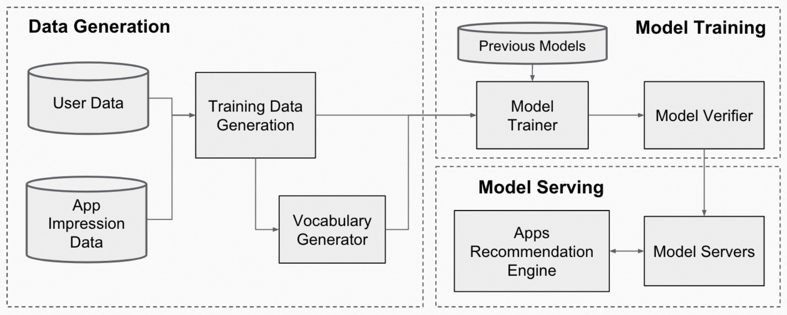

# Wide & deep learning for recommender systems

## Meta Info

Presented in [arxiv:1606.07792](http://arxiv.org/abs/1606.07792). (Accepted in [DLRS 2016](https://dl.acm.org/doi/10.1145/2988450.2988454))

Authors: Heng-Tze Cheng, Levent Koc, Jeremiah Harmsen, Tal Shaked, Tushar Chandra, Hrishi Aradhye, Glen Anderson, Greg Corrado, Wei Chai, Mustafa Ispir, Rohan Anil, Zakaria Haque, Lichan Hong, Vihan Jain, Xiaobing Liu, Hemal Shah (_Google_).

## Understanding the paper

### Background

* A recommender system
  * A search ranking system
  * Input: a set of user and contextual information
  * Output: a ranked list of items
  * Workflow
    * Retrieval
      * The retrieval system returns _a short list of items_ that best match the query using various signals, usually _a combination of machine-learned models and human-defined rules_.
    * Rank (this work focuses on the ranking model)
      * Rank all items by their scores.

### Wide & Deep model structure

* Wide component
  * Generalized linear model
  * Cross-product transformation
* Deep component
  * Feed-forward NN
  * High-dimensional categorical features are converted into _a low-dimensional and dense real-valued vector_, often referred to as _an embedding vector_.
  * The dimensionality of the embeddings is usually on the order of O(10) to O(100).

<figure><figcaption>
Wide &#x26; Deep model structure for apps recommendation.
</figcaption></figure>

### Recommendation pipeline overview

* Model Training
  * _Warm-start_: initialize a new model with the embeddings and the linear model weights from the previous model
  * _Dry-run_ the model before loading the models into the servers
* Model Serving
  * Each request includes a set of item candidates and user features
  * Use _multithreading parallelism_ to _run smaller batches in parallel_, instead of _scoring all candidate items in a single-batch inference_

<figure><figcaption>
Apps recommendation pipeline overview.
</figcaption></figure>
